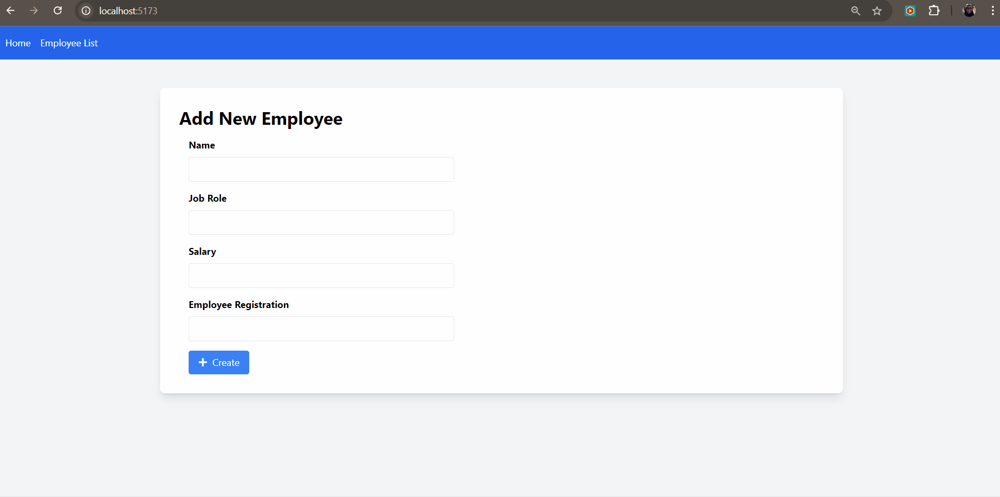

# Full Stack Application with React, Azure Static Web Apps and Azure Functions - Part 01

Repository link: **[https://github.com/glaucia86/todo-react-aswa-azure-functions](https://github.com/glaucia86/todo-react-aswa-azure-functions)**

## Project Introduction

The goal of this project is to develop a CRUD application using React, integrating with Azure services such as:

- 🔹Azure Static Web Apps
- 🔹Azure Functions
- 🔹Azure Container Apps
- 🔹Azure SQL Database

We will also use Prisma as the ORM and GitHub Actions for CI/CD. This project aims to demonstrate how to combine these technologies to create a robust, scalable, and easy-to-maintain web application.

## Initial Project Setup - FrontEnd

If you’re not interested in learning how to create the frontend from scratch, you can clone the project directly from the `frontend-project` branch using the repository link: **[fullstack-app-react-aswa-azure-functions](https://github.com/glaucia86/fullstack-app-react-aswa-azure-functions.git)** and run the `npm install` command to install the necessary dependencies.

```text
https://github.com/glaucia86/fullstack-app-react-aswa-azure-functions/tree/frontend-project
```

```bash
git clone
```

```bash
npm install
```

Open a terminal and run the command:

```bash
npm run dev
```

Open another terminal and run the command:

```bash
npm run mock-api
```

Now you can access the application in your browser at `http://localhost:5173/` and see it running locally. If it’s working like the gif below, you’re on the right track:



Now, if you want to learn how to create the project from scratch, move on to the next section.

**[Next: Session 02 ➡️](02-session.md)**