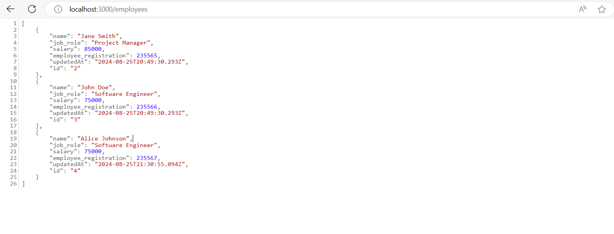

# Session 02: Project Setup - FrontEnd

In this session, we will learn how to set up the development environment for our employee management application. We will follow a step-by-step process to ensure everything is correctly configured.

Let's get started!

## Project Initialization

First, let's create a new **[React](https://react.dev/)** project with **[TypeScript](https://www.typescriptlang.org/)**, but using **[Vite](https://vitejs.dev/)**. Vite is a fast and modern build tool that works with React, Vue, and Vanilla JavaScript.

To create a new project, open your terminal and navigate to the directory where you want to create the project. Then, run the following command:

```bash
npm create vite@latest client -- --template react-ts
```

This command will create a new React project with TypeScript using a basic React + TypeScript project structure.

Now, navigate to the `client` project directory and install the project dependencies:

```bash
cd client
npm install
```

Run the command to check if the project was created correctly:

```bash
npm run dev
```

Open your preferred browser and go to `http://localhost:5173/`. You should see the React with Vite project's homepage.

## Installing Project Dependencies

During the development of the project, we will need some dependencies necessary for the development of the FrontEnd application. Let's install these dependencies now.

Run the following command to install the required dependencies:

```bash
npm install react-router-dom axios sweetalert2 react-icons react-number-format
```

Let's explain what each of these dependencies will do in the project:

- **[react-router-dom](https://www.npmjs.com/package/react-router-dom)**: is a routing library for React that allows us to navigate between different React components. Since we'll be creating some pages for the application, we need this library to navigate between them.

- **[axios](https://www.npmjs.com/package/axios)**: is a library that allows us to make HTTP requests to the server. We'll use Axios to make HTTP requests to the API server. Through it, we'll also communicate with the server (BackEnd).

- **[sweetalert2](https://www.npmjs.com/package/sweetalert2)**: is a library that allows us to display customized message alerts. We'll use SweetAlert2 to display success, error, and warning messages to the user.

- **[react-icons](https://www.npmjs.com/package/react-icons)**: is a library that allows us to use icons in our React components. We'll use React Icons to add icons to the application's buttons.

- **[react-number-format](https://www.npmjs.com/package/react-number-format)**: is a library that allows us to format numbers in our React components. We'll use React Number Format to format the employee's `salary` field.

Now let's install the development dependencies:

```bash
npm install -D @types/react-router-dom tailwindcss postcss autoprefixer
```

Let's explain what each of these dependencies will do in the project:

- **[@types/react-router-dom](https://www.npmjs.com/package/@types/react-router-dom)**: is a TypeScript types package for the `react-router-dom` library. We'll use this package to add types to `react-router-dom`.
- **[tailwindcss, postcss, autoprefixer](https://www.npmjs.com/package/tailwindcss)**: is a utility-first CSS framework that allows us to create styles quickly. We'll use Tailwind CSS to style the application.

> **Note**: Tailwind CSS is a utility-first CSS framework that allows us to create styles quickly. We'll use Tailwind CSS to style the application. If you're not familiar with Tailwind CSS, we recommend reading the [official documentation](https://tailwindcss.com/docs/installation).

## Tailwind CSS Configuration

Since we'll be using Tailwind CSS to style the application, we need to configure it before using it in the project. To do this, open the terminal inside the `client` folder and run the following command:

```bash
npx tailwindcss init -p
```

Running the above command will create two files at the root of the project:

- `tailwind.config.js`: is the Tailwind CSS configuration file. In this file, you can customize the Tailwind CSS settings.
- `postcss.config.js`: is the PostCSS configuration file. In this file, you can add PostCSS plugins.

We'll need to make a small change to the `tailwind.config.js` file. Open the `tailwind.config.js` file and add the following code:

- **file**: `tailwind.config.js`:

```javascript
/** @type {import('tailwindcss').Config} */
export default {
  content: ['./index.html', './src/**/*.{js,ts,jsx,tsx}'],
  theme: {
    extend: {},
  },
  plugins: [],
};
```

This file configures Tailwind to process HTML and JavaScript/TypeScript files within the `src` directory.

We still need to make other configurations for Tailwind CSS to work correctly. Open the `src/index.css` file and add the following code:

- **file**: `src/index.css`:

```css
@tailwind base;
@tailwind components;
@tailwind utilities;
```

This file will allow you to use Tailwind CSS classes throughout your application.

## ESLint Configuration

ESLint is a static code analysis tool to identify and fix problems in JavaScript/TypeScript code. Since we created the project using Vite, ESLint is already configured to work with TypeScript. However, ensure that the `eslint.config.js` file is correctly configured.

<details><summary><b>eslint.config.js</b></summary>
<br/>

```javascript
import js from '@eslint/js'
import globals from 'globals'
import reactHooks from 'eslint-plugin-react-hooks'
import reactRefresh from 'eslint-plugin-react-refresh'
import tseslint from 'typescript-eslint'

export default tseslint.config(
  { ignores: ['dist'] },
  {
    extends: [js.configs.recommended, ...tseslint.configs.recommended],
    files: ['**/*.{ts,tsx}'],
    languageOptions: {
      ecmaVersion: 2020,
      globals: globals.browser,
    },
    plugins: {
      'react-hooks': reactHooks,
      'react-refresh': reactRefresh,
    },
    rules: {
      ...reactHooks.configs.recommended.rules,
      'react-refresh/only-export-components': [
        'warn',
        { allowConstantExport: true },
      ],
    },
  },
)
```

</details>
<br/>

This is the basic ESLint configuration for the project automatically generated by Vite. It includes recommended rules for JavaScript and TypeScript, as well as specific rules for React Hooks.

However, you can add other custom rules as needed for your project.

## API Mock Script Setup using `json-server`

Since our BackEnd is not ready yet, we will use a package called `json-server` to simulate a REST API. Let's install `json-server` as a development dependency.

Run the following command to install `json-server`:

```bash
npm install json-server
```

Next, we need to create a file at the root of the project called `db.json`. Why? Because this file will be used to store the application's data while our BackEnd is not ready.

<details><summary><b>db.json</b></summary>
<br/>

```json
{
  "employees": [
    {
      "name": "Jane Smith",
      "job_role": "Project Manager",
      "salary": 85000,
      "employee_registration": 235565,
      "updatedAt": "2024-08-25T20:49:30.293Z",
      "id": "2"
    },
    {
      "name": "John Doe",
      "job_role": "Software Engineer",
      "salary": 75000,
      "employee_registration": 235566,
      "updatedAt": "2024-08-25T20:49:30.293Z",
      "id": "3"
    },
    {
      "name": "Alice Johnson",
      "job_role": "Software Engineer",
      "salary": 75000,
      "employee_registration": 235567,
      "updatedAt": "2024-08-25T21:30:55.094Z",
      "id": "4"
    }
  ]
}
```

</details>
<br/>

Now that we have the `db.json` file created, let's add a script in the `package.json` file to start `json-server`. Open the `package.json` file and add the following script:

<details><summary><b>package.json</b></summary>
<br/>

```json
  "scripts": {
    "dev": "vite",
    "build": "tsc -b && vite build",
    "lint": "eslint .",
    "preview": "vite preview",
    "mock-api": "json-server db.json --port 3000"
  },
```

</details>
<br/>

## Configuration Verification

Now that we've set up the development environment for the project, it's time to check if everything is working correctly. Run the following command in the Visual Studio Code terminal:

```bash
npm run mock-api
```

This command will start `json-server` and create a REST API with the data from the `db.json` file. Open your preferred browser and go to `http://localhost:3000/employees`. You should see the employee data stored in the `db.json` file.



Next, open another terminal in Visual Studio Code and run the following command:

```bash
npm run dev
```

This command will start the Vite development server. Open your preferred browser and go to `http://localhost:5173/`. You should see the React with Vite project's homepage.

> **Note**: if you prefer, you can run the command: `npm run dev-start`. This command will start the application and `json-server` at the same time.

## Project Structure

Now that we have set up the development environment, your project structure should look like this:

```text
client/
  ├── node_modules/
  ├── public/
  ├── src/
  │   ├── components/
  │   ├── pages/
  │   ├── services/
  │   ├── types/
  │   ├── App.css
  │   ├── App.tsx
  │   ├── index.css
  │   ├── main.tsx
  │   ├── vite-env.d.ts
  ├── .gitignore
  ├── db.json
  ├── eslint.config.js
  ├── index.html
  ├── package-lock.json
  ├── package.json
  ├── postcss.config.js
  ├── README.md
  ├── tailwind.app.json
  ├── tsconfig.json
  ├── tsconfig.node.json
  ├── vite.config.ts
```

Most of this structure was automatically created by Vite when we set up the project. However, as we progress with the development, we'll be adding new folders and files to better organize the project.

## Conclusion

And that's it! In this session, we learned how to set up the development environment for the employee management project.
We also configured Tailwind CSS, ESLint, and `json-server` to simulate a REST API.

In the next session, we will create the folder and file structure needed for the application development.

See you in the next session!

**[Previous: Session 01 ➡️](01-session.md)** | **[Next: Session 03 ➡️](03-session.md)**
