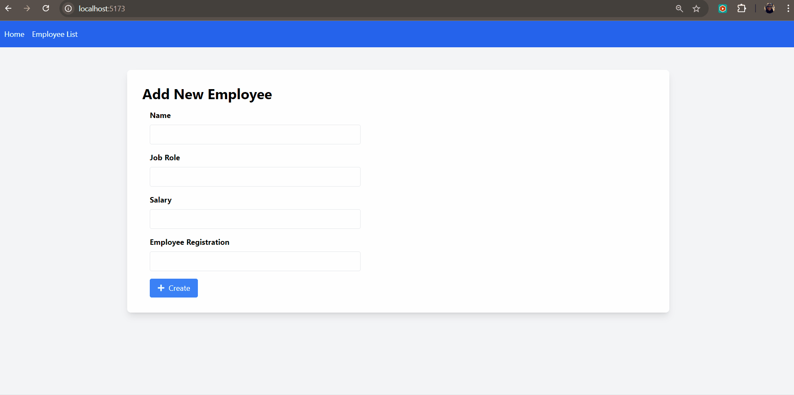

# Session 05: Creating React Components

In this session, we will focus on creating the main components of our employee management application.

This step is crucial as we will create the user interface and logic of our application.

We will create two React components, which will be the main ones for our application:

- `EmployeeForm`: Component responsible for creating a new employee.
- `EmployeeList`: Component responsible for listing existing employees, with the ability to edit and delete employees.

By the end, the project will look like the GIF below:



Let's now create these components.

## Creating the `EmployeeForm` Component

The `EmployeeForm` will be a reusable component for creating a new employee. It will be a simple form with the following fields: _name_, _job role_, _salary_, and _employee registration_.

Follow the steps below:

1. Create a new file inside: `src/components/EmployeeForm.tsx`

```bash
touch src/components/EmployeeForm.tsx
```

2. Now open the EmployeeForm.tsx file and start by adding the necessary imports:

<details><summary><b>src/components/EmployeeForm.tsx</b></summary>

```tsx	
import React, { useReducer } from 'react';
import { Employee } from '../types/employee.interface';
import { NumericFormat, NumericFormatProps } from 'react-number-format';
import { FaPlus, FaEdit } from 'react-icons/fa';
```

</details> 
<br/>

3. Define the component's props and initial state:
   
<details><summary><b>src/components/EmployeeForm.tsx</b></summary>

```tsx
interface EmployeeFormProps {
  employee?: Employee;
  onSubmit: (employee: Omit<Employee, 'id' | 'createdAt' | 'updatedAt'>) => void;
}

type EmployeeFormState = {
  name: string;
  job_role: string;
  salary: string;
  employee_registration: string;
};

type EmployeeFormAction = {
  [K in keyof EmployeeFormState]: { field: K; value: EmployeeFormState[K] };
}[keyof EmployeeFormState];
```

</details>
<br/>

We will explain each part of the code later. For now, let's continue with the component's implementation.

4. Implement the reducer to manage the form's state:
   
<details><summary><b>src/components/EmployeeForm.tsx</b></summary>

```tsx
const employeeFormReducer = (
  state: EmployeeFormState,
  action: EmployeeFormAction
): EmployeeFormState => {
  return {
    ...state,
    [action.field]: action.value,
  };
};
```

</details> 
<br/>

5. Now we are ready to implement the EmployeeForm component:

<details><summary><b>src/components/EmployeeForm.tsx</b></summary>

```tsx
export default function EmployeeForm({ employee, onSubmit }: EmployeeFormProps) {
  const initialEmployeeValues: EmployeeFormState = {
    name: employee?.name || '',
    job_role: employee?.job_role || '',
    salary: employee?.salary?.toString() || '',
    employee_registration: employee?.employee_registration?.toString() || '',
  };

  const [employeeFormValues, dispatch] = useReducer(
    employeeFormReducer,
    initialEmployeeValues
  );

  const { name, job_role, salary, employee_registration } = employeeFormValues;

  function handleEmployeeFormChange(
    event: React.ChangeEvent<HTMLInputElement>
  ) {
    const { name, value } = event.target;
    dispatch({ field: name as keyof EmployeeFormState, value });
  }

  const handleSalaryChange = (values: NumericFormatProps) => {
    const valueString = values.value ? values.value.toString() : '';
    dispatch({ field: 'salary', value: valueString });
  };

  const handleEmployeeSubmit = (event: React.FormEvent) => {
    event.preventDefault();
    onSubmit({
      name,
      job_role,
      salary: parseFloat(salary),
      employee_registration: parseInt(employee_registration, 10),
    });
  };

  // Form rendering omitted
}
```

</details>
<br/>

6. Now, let's implement the form rendering:
   
<details><summary><b>src/components/EmployeeForm.tsx</b></summary>

```tsx
return (
    <form onSubmit={handleEmployeeSubmit} className='max-w-md'>
      <div className='mb-4'>
        <label htmlFor='name' className='block mb-2 font-bold'>
          Name
        </label>
        <input
          type='text'
          id='name'
          name='name'
          value={name}
          onChange={handleEmployeeFormChange}
          required
          className='w-full px-3 py-2 border rounded'
        />
      </div>
      <div className='mb-4'>
        <label htmlFor='job_role' className='block mb-2 font-bold'>
          Job Role
        </label>
        <input
          type='text'
          id='job_role'
          name='job_role'
          value={job_role}
          onChange={handleEmployeeFormChange}
          required
          className='w-full px-3 py-2 border rounded'
        />
      </div>
      <div className='mb-4'>
        <label htmlFor='salary' className='block mb-2 font-bold'>
          Salary
        </label>
        <NumericFormat
          id='salary'
          name='salary'
          value={salary}
          onValueChange={handleSalaryChange}
          thousandSeparator={true}
          prefix={'$'}
          required
          className='w-full px-3 py-2 border rounded'
        />
      </div>
      <div className='mb-4'>
        <label htmlFor='employee_registration' className='block mb-2 font-bold'>
          Employee Registration
        </label>
        <input
          type='number'
          id='employee_registration'
          name='employee_registration'
          value={employee_registration}
          onChange={handleEmployeeFormChange}
          required
          className='w-full px-3 py-2 border rounded'
        />
      </div>
      <button
        type='submit'
        className='bg-blue-500 text-white px-4 py-2 rounded flex items-center space-x-2'
      >
        {employee ? (
          <>
            <FaEdit />
            <span>Update</span>
          </>
        ) : (
          <>
            <FaPlus />
            <span>Create</span>
          </>
        )}
      </button>
    </form>
  );
```

</details>
<br/>

Perfect! Now we have the EmployeeForm component ready.

In the end, the `EmployeeForm.tsx` file should look like this:

<details><summary><b>src/components/EmployeeForm.tsx</b></summary>

```tsx
import React, { useReducer } from 'react';
import { Employee } from '../types/employee.interface';

import { NumericFormat, NumericFormatProps } from 'react-number-format';
import { FaPlus, FaEdit } from 'react-icons/fa';

interface EmployeeFormProps {
  employee?: Employee;
  onSubmit: (
    employee: Omit<Employee, 'id' | 'createdAt' | 'updatedAt'>
  ) => void;
}

type EmployeeFormState = {
  name: string;
  job_role: string;
  salary: string;
  employee_registration: string;
};

type EmployeeFormAction = {
  [K in keyof EmployeeFormState]: { field: K; value: EmployeeFormState[K] };
}[keyof EmployeeFormState];

const employeeFormReducer = (
  state: EmployeeFormState,
  action: EmployeeFormAction
): EmployeeFormState => {
  return {
    ...state,
    [action.field]: action.value,
  };
};

export default function EmployeeForm({
  employee,
  onSubmit,
}: EmployeeFormProps) {
  const initialEmployeeValues: EmployeeFormState = {
    name: employee?.name || '',
    job_role: employee?.job_role || '',
    salary: employee?.salary?.toString() || '',
    employee_registration: employee?.employee_registration?.toString() || '',
  };

  const [employeeFormValues, dispatch] = useReducer(
    employeeFormReducer,
    initialEmployeeValues
  );

  const { name, job_role, salary, employee_registration } = employeeFormValues;

  function handleEmployeeFormChange(
    event: React.ChangeEvent<HTMLInputElement>
  ) {
    const { name, value } = event.target;
    dispatch({ field: name as keyof EmployeeFormState, value });
  }

  const handleSalaryChange = (values: NumericFormatProps) => {
    const valueString = values.value ? values.value.toString() : '';
    dispatch({ field: 'salary', value: valueString });
  };

  const handleEmployeeSubmit = (event: React.FormEvent) => {
    event.preventDefault();
    onSubmit({
      name,
      job_role,
      salary: parseFloat(salary),
      employee_registration: parseInt(employee_registration, 10),
    });
  };

  return (
    <form onSubmit={handleEmployeeSubmit} className='max-w-md'>
      <div className='mb-4'>
        <label htmlFor='name' className='block mb-2 font-bold'>
          Name
        </label>
        <input
          type='text'
          id='name'
          name='name'
          value={name}
          onChange={handleEmployeeFormChange}
          required
          className='w-full px-3 py-2 border rounded'
        />
      </div>
      <div className='mb-4'>
        <label htmlFor='job_role' className='block mb-2 font-bold'>
          Job Role
        </label>
        <input
          type='text'
          id='job_role'
          name='job_role'
          value={job_role}
          onChange={handleEmployeeFormChange}
          required
          className='w-full px-3 py-2 border rounded'
        />
      </div>
      <div className='mb-4'>
        <label htmlFor='salary' className='block mb-2 font-bold'>
          Salary
        </label>
        <NumericFormat
          id='salary'
          name='salary'
          value={salary}
          onValueChange={handleSalaryChange}
          thousandSeparator={true}
          prefix={'$'}
          required
          className='w-full px-3 py-2 border rounded'
        />
      </div>
      <div className='mb-4'>
        <label htmlFor='employee_registration' className='block mb-2 font-bold'>
          Employee Registration
        </label>
        <input
          type='number'
          id='employee_registration'
          name='employee_registration'
          value={employee_registration}
          onChange={handleEmployeeFormChange}
          required
          className='w-full px-3 py-2 border rounded'
        />
      </div>
      <button
        type='submit'
        className='bg-blue-500 text-white px-4 py-2 rounded flex items-center space-x-2'
      >
        {employee ? (
          <>
            <FaEdit />
            <span>Update</span>
          </>
        ) : (
          <>
            <FaPlus />
            <span>Create</span>
          </>
        )}
      </button>
    </form>
  );
}
```

</details>
<br/>

Let’s break down some parts of the code:

- `EmployeeFormProps`: Interface that defines the properties of the EmployeeForm component. In this case, we have the optional employee property and the onSubmit function that will be called when the form is submitted.
  
- `EmployeeFormState`: Interface that defines the form's state. Here, we have the fields `name`, `job_role`, `salary`, and `employee_registration`.
  
- `EmployeeFormAction`: Type that defines the possible actions for the form. We map each field of the form to an object with the `field` key and its corresponding value.
  
- `employeeFormReducer`: Function that takes the current state and an action, returning the new state of the form.
  
- `EmployeeForm`: The main component that renders the form. We define the initial form state, the `reducer` to manage the state, functions to handle field changes, and the form submission.

- `handleEmployeeFormChange`: Function that is called when a form field is changed. It updates the form state with the new field value.
  
- `handleSalaryChange`: Function that is called when the `salary` field is changed. It updates the form state with the new formatted number.
  
- `handleEmployeeSubmit`: Function that is called when the form is submitted. It calls the `onSubmit` function with the form values.

Now that we have the `EmployeeForm` component ready, let’s create the `EmployeeList` component.

## Creating the `EmployeeList` Component

The `EmployeeList` will be a reusable component for listing existing employees. It will be a simple table with employee information and buttons to edit and delete employees.

Follow the steps below:

1. Create a new file inside: `src/components/EmployeeList.tsx`

```bash
touch src/components/EmployeeList.tsx
```

2. Now open the `EmployeeList.tsx` file and start by adding the necessary imports:

<details><summary><b>src/components/EmployeeList.tsx</b></summary>

```tsx
import React, { useState, useEffect } from 'react';
import { useNavigate } from 'react-router-dom';
import { Employee } from '../types/employee.interface';
import { deleteEmployee, getEmployees } from '../services/employee.services';
import Swal from 'sweetalert2';
import { NumericFormat } from 'react-number-format';
import { FaEdit, FaTrash } from 'react-icons/fa';
```

</details>
<br/>

3. Create the `EmployeeList` component:

<details><summary><b>src/components/EmployeeList.tsx</b></summary>

```tsx
const EmployeeList: React.FC = () => {
  const [employees, setEmployees] = useState<Employee[]>([]);
  const navigate = useNavigate();

  useEffect(() => {
    fetchEmployees();
  }, []);

  const fetchEmployees = async () => {
    try {
      const data = await getEmployees();
      setEmployees(data);
    } catch (error) {
      console.error('Error fetching employees:', error);
      Swal.fire({
        title: 'Error!',
        text: 'There was a problem fetching employees',
        icon: 'error',
        confirmButtonText: 'OK',
      });
    }
  };

  const handleDelete = async (id: string) => {
    const result = await Swal.fire({
      title: 'Are you sure you want to delete this employee?',
      text: 'You will not be able to revert this!',
      icon: 'warning',
      showCancelButton: true,
      confirmButtonColor: '#3085d6',
      cancelButtonColor: '#d33',
      confirmButtonText: 'Yes, delete it!',
      cancelButtonText: 'No, cancel!',
    });

    if (result.isConfirmed) {
      try {
        await deleteEmployee(id);
        Swal.fire({
          title: 'Deleted!',
          text: 'Employee has been deleted.',
          icon: 'success',
        });
        fetchEmployees();
      } catch (error) {
        console.error('Error deleting employee:', error);
        Swal.fire({
          title: 'Error!',
          text: 'There was a problem deleting the employee',
          icon: 'error',
          confirmButtonText: 'OK',
        });
      }
    }
  };

  const handleUpdate = (id: string) => {
    navigate(`/update/${id}`);
  };

  // Employee list rendering omitted
};

export default EmployeeList;
```

</details>
<br/>

4. Now, let's implement the employee list rendering:

<details><summary><b>src/components/EmployeeList.tsx</b></summary>

```tsx
return (
    <div className='container mx-auto mt-8'>
      <table className='min-w-full bg-white border border-gray-300 shadow-lg'>
        <thead>
          <tr>
            <th className='py-2 px-4 border-b text-center'>Name</th>
            <th className='py-2 px-4 border-b text-center'>Job Role</th>
            <th className='py-2 px-4 border-b text-center'>Salary</th>
            <th className='py-2 px-4 border-b text-center'>Registration</th>
            <th className='py-2 px-4 border-b text-center'>Actions</th>
          </tr>
        </thead>
        <tbody>
          {employees.map((employee) => (
            <tr key={employee.id}>
              <td className='py-2 px-4 border-b text-center'>
                {employee.name}
              </td>
              <td className='py-2 px-4 border-b text-center'>
                {employee.job_role}
              </td>
              <td className='py-2 px-4 border-b text-center'>
                <NumericFormat
                  value={employee.salary}
                  displayType={'text'}
                  thousandSeparator={true}
                  prefix={'$'}
                />
              </td>
              <td className='py-2 px-4 border-b text-center'>
                {employee.employee_registration}
              </td>
              <td className='py-2 px-4 border-b text-center flex justify-center items-center'>
                <button
                  onClick={() => handleUpdate(employee.id)}
                  className='bg-blue-500 text-white px-2 py-1 rounded flex items-center justify-center'
                >
                  <FaEdit />
                </button>
                <button
                  onClick={() => handleDelete(employee.id)}
                  className='bg-red-500 text-white px-2 py-1 rounded flex items-center justify-center ml-2'
                >
                  <FaTrash />
                </button>
              </td>
            </tr>
          ))}
        </tbody>
      </table>
    </div>
  );
```

</details>
<br/>

Perfect! Now we have the `EmployeeList` component ready.

In the end, the `EmployeeList.tsx` file should look like this:

<details><summary><b>src/components/EmployeeList.tsx</b></summary>

```tsx
import React, { useState, useEffect } from 'react';
import { useNavigate } from 'react-router-dom';
import { Employee } from '../types/employee.interface';
import { deleteEmployee, getEmployees } from '../services/employee.services';

import Swal from 'sweetalert2';
import { NumericFormat } from 'react-number-format';
import { FaEdit, FaTrash } from 'react-icons/fa';

const EmployeeList: React.FC = () => {
  const [employees, setEmployees] = useState<Employee[]>([]);
  const navigate = useNavigate();

  useEffect(() => {
    fetchEmployees();
  }, []);

  const fetchEmployees = async () => {
    try {
      const data = await getEmployees();
      setEmployees(data);
    } catch (error) {
      console.error('Error fetching employees:', error);
      Swal.fire({
        title: 'Error!',
        text: 'There was a problem fetching employees',
        icon: 'error',
        confirmButtonText: 'OK',
      });
    }
  };

  const handleDelete = async (id: string) => {
    const result = await Swal.fire({
      title: 'Are you sure you want to delete this employee?',
      text: 'You will not be able to revert this!',
      icon: 'warning',
      showCancelButton: true,
      confirmButtonColor: '#3085d6',
      cancelButtonColor: '#d33',
      confirmButtonText: 'Yes, delete it!',
      cancelButtonText: 'No, cancel!',
    });

    if (result.isConfirmed) {
      try {
        await deleteEmployee(id);
        Swal.fire({
          title: 'Deleted!',
          text: 'Employee has been deleted.',
          icon: 'success',
        });
        fetchEmployees();
      } catch (error: unknown) {
        const err = error as Error;
        console.error(`Failed to delete employee: ${err.message}`);
        Swal.fire({
          title: 'Error!',
          text: 'There was a problem deleting the employee',
          icon: 'error',
          confirmButtonText: 'OK',
        });
      }
    } else if (result.dismiss === Swal.DismissReason.cancel) {
      Swal.fire({
        title: 'Cancelled',
        text: 'Employee deletion has been cancelled',
        icon: 'error',
      });
    }
  };

  const handleUpdate = (id: string) => {
    navigate(`/update/${id}`);
  };

  return (
    <div className='container mx-auto mt-8'>
      <table className='min-w-full bg-white border border-gray-300 shadow-lg'>
        <thead>
          <tr>
            <th className='py-2 px-4 border-b text-center'>Name</th>
            <th className='py-2 px-4 border-b text-center'>Job Role</th>
            <th className='py-2 px-4 border-b text-center'>Salary</th>
            <th className='py-2 px-4 border-b text-center'>Registration</th>
            <th className='py-2 px-4 border-b text-center'>Actions</th>
          </tr>
        </thead>
        <tbody>
          {employees.map((employee) => (
            <tr key={employee.id}>
              <td className='py-2 px-4 border-b text-center'>
                {employee.name}
              </td>
              <td className='py-2 px-4 border-b text-center'>
                {employee.job_role}
              </td>
              <td className='py-2 px-4 border-b text-center'>
                <NumericFormat
                  value={employee.salary}
                  displayType={'text'}
                  thousandSeparator={true}
                  prefix={'$'}
                />
              </td>
              <td className='py-2 px-4 border-b text-center'>
                {employee.employee_registration}
              </td>
              <td className='py-2 px-4 border-b text-center flex justify-center items-center'>
                <button
                  onClick={() => handleUpdate(employee.id)}
                  className='bg-blue-500 text-white px-2 py-1 rounded flex items-center justify-center'
                >
                  <FaEdit />
                </button>
                <button
                  onClick={() => handleDelete(employee.id)}
                  className='bg-red-500 text-white px-2 py-1 rounded flex items-center justify-center ml-2'
                >
                  <FaTrash />
                </button>
              </td>
            </tr>
          ))}
        </tbody>
      </table>
    </div>
  );
};

export default EmployeeList;
```

</details>
<br/>

Let’s break down some parts of the code:

- `EmployeeList`: The main component that renders the list of employees. We define the initial state of the employee list, the `fetchEmployees` function to retrieve employees, and the `handleDelete` and `handleUpdate` functions to handle the deletion and editing of employees, respectively.
  
- `useEffect`: React Hook that is called when the component is mounted. Here, we call the `fetchEmployees` function to fetch the employees.
  
- `fetchEmployees`: Asynchronous function that retrieves employees from the API and updates the employee list state.
handleDelete: Asynchronous function that is called when the delete button of an employee is clicked. It shows a confirmation modal and, if the user confirms, deletes the employee from the API and updates the employee list.

- `handleUpdate`: Function that is called when the edit button of an employee is clicked. It navigates to the employee's edit page.

Notice that we are using the `sweetalert2` package to show alert messages and the `react-number-format` package to format the salary field as a monetary value.

These components form the core of our user interface, allowing users to interact with employee data in an intuitive and efficient way.

## Conclusion

By creating these React components, we established the main structure of our user interface. The `EmployeeForm` allows us to create a new employee, while the `EmployeeList` lets us view, edit, and delete existing employees.

These components use React best practices, such as **[hooks](https://react.dev/reference/react/hooks)**, **[useState](https://react.dev/reference/react/useState)**, **[useReducer](https://react.dev/reference/react/useReducer)**, **[useEffect](https://react.dev/reference/react/useEffect)** and efficient state management. 

Additionally, we integrated useful libraries like **[SweetAlert2](https://sweetalert2.github.io/)** to enhance user experience and **[react-router-dom](https://www.npmjs.com/package/react-router-dom)** for navigation.

In the next session, we will see how to integrate these components into our main pages and configure the application's routing.

See you in the next session!

**[Previous: Session 04 ⬅️](04-session.md)** | **[Next: Session 06 ➡️](06-session.md)**