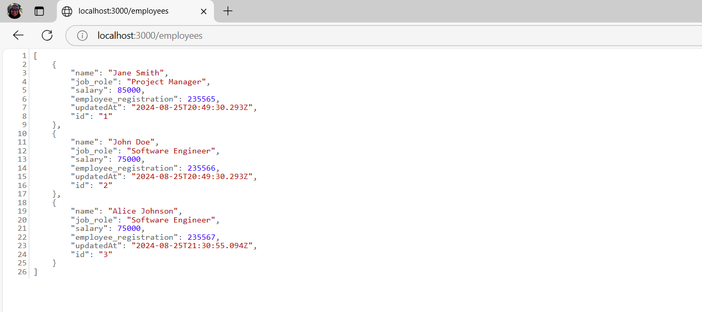

# Session 09: Mock API Configuration

In this session, we will set up a mock server to simulate a REST API, allowing our application to perform real CRUD operations during client-side development.

We will use a package called `json-server`, a powerful tool that transforms a JSON file into a complete REST API.

Let's get started!

## Creating the Mock Data File

First, we’ll create our data file, which will serve as our mock "database."

Create a file named `db.json` in the project root:

```bash
touch db.json
```

Now, add the following content to the `db.json` file:

```json
{
  "employees": [
    {
      "name": "Jane Smith",
      "job_role": "Project Manager",
      "salary": 85000,
      "employee_registration": 235565,
      "updatedAt": "2024-08-25T20:49:30.293Z",
      "id": "1"
    },
    {
      "name": "John Doe",
      "job_role": "Software Engineer",
      "salary": 75000,
      "employee_registration": 235566,
      "updatedAt": "2024-08-25T20:49:30.293Z",
      "id": "2"
    },
    {
      "name": "Alice Johnson",
      "job_role": "Software Engineer",
      "salary": 75000,
      "employee_registration": 235567,
      "updatedAt": "2024-08-25T21:30:55.094Z",
      "id": "3"
    }
  ]
}
```

Perfect! Now we have a JSON file with some sample data. Remember, you can add more data as needed.

Let’s continue configuring our mock server.

## Installing and Configuring `json-server`

We will need to install `json-server` as a development dependency. To do so, run the following command:

```bash
npm install json-server --save-dev
```

Now, add the following script to the `package.json` file:

```json
// ... other scripts
"scripts": {
  "mock-api": "json-server db.json --port 3000"
}
```

Let’s test the mock server. Run the following command:

```bash
npm run mock-api
```

If everything goes well, you will see a message similar to the image below:


## Verifying the Configuration

Now that the mock server is running, open your browser and go to the URL `http://localhost:3000/employees`. You will see the data we added to the `db.json` file.



Alternatively, we can test it differently. Keep the mock server running, open a new terminal, and run the following command:

```bash
curl http://localhost:3000/employees
```

You’ll see the data output in the terminal. We can also test other operations, like `POST`, `PUT`, and `DELETE`. Shall we test them?

- Get a specific employee:

```bash
curl http://localhost:3000/employees/2
```

- Add a new employee:

```bash
curl -X POST -H "Content-Type: application/json" -d '{
  "name": "Glaucia Lemos",
  "job_role": "Developer Advocate",
  "salary": 6500,
  "employee_registration": 889944,
  "updatedAt": "2024-10-25T20:49:30.293Z",
  "id": "4"
}' http://localhost:3000/employees
```

- Update an employee:

```bash
curl -X PUT -H "Content-Type: application/json" -d '{
  "name": "Glaucia Lemos",
  "job_role": "Senior Developer Advocate",
  "salary": 6500,
  "employee_registration": 889944,
  "updatedAt": "2024-10-25T20:49:30.293Z",
  "id": "4"
}' http://localhost:3000/employees/4
```

- Delete an employee:

```bash
curl -X DELETE http://localhost:3000/employees/4
```

After testing the CRUD operations, you can stop the mock server by pressing `Ctrl + C` in the terminal.

Good job! Now we have a configured mock server ready to be used on the client side. For this, we will need to adjust our application to consume this data.

## Adjusting the `employee.services.ts` File to Consume the Mock API

Let's adjust the `employee.services.ts` file to consume the mock server we just set up.

Open the `employee.services.ts` file and check if it is using the correct URL to consume the REST API.

<details><summary><b>src/services/employee.services.ts</b></summary>
<br/>

```typescript
const API_BASE_URL = 'http://localhost:3000/employees';

const employeeApi = axios.create({
  baseURL: API_BASE_URL,
  headers: {
    'Content-Type': 'application/json'
  }
});
```

</details>
<br/>

Remember, we will be temporarily using the mock server to simulate the REST API. However, when the application is ready to be deployed, you will need to adjust the URL to point to the real server, which in this case will be Azure Functions.

## Best Practices and Tips

1. **Data Persistence:** 
   - 👉 `json-server` automatically saves changes to the `db.json` file.
   - 👉 You can create a backup of the file to reset the data when necessary.

2. **Filtering and Sorting:**
   - 👉 `json-server` supports data filtering and sorting. For example:

```bash
// Filter by job role
GET /employees?job_role=Software Engineer

// Sort by salary
GET /employees?_sort=salary&_order=desc

// Limit results
GET /employees?_limit=2
```

3. **Simulating Latency:**
   - 👉 You can simulate server response latency by adding the `--delay` flag to the `json-server` command. For example:

```bash
npm run mock-api -- --delay 1000
```

4. **Data Backup:**
   - 👉 Regularly back up the `db.json` file to avoid data loss. For example:

```bash
# Create a copy of db.json
cp db.json db.backup.json

# Restore the backup
cp db.backup.json db.json
```

## Conclusion

In this session, we set up a mock server using `json-server` to simulate a REST API. This will allow us to develop the client side without depending on a real server.

With our Mock API configured, we now have a complete development environment that perfectly simulates a real backend. This allows us to:

- 🔹 Test all CRUD operations of the application.
- 🔹 Work with persistent data during development.
- 🔹 Simulate real API scenarios.
- 🔹 Develop the FrontEnd independently from the BackEnd.

In the last part of this tutorial (on the client side), we will test our application with the mock server and check if everything is working correctly.

**[Previous: Session 07 ⬅️](07-session.md)** | **[Next: Session 09 ➡️](09-session.md)**