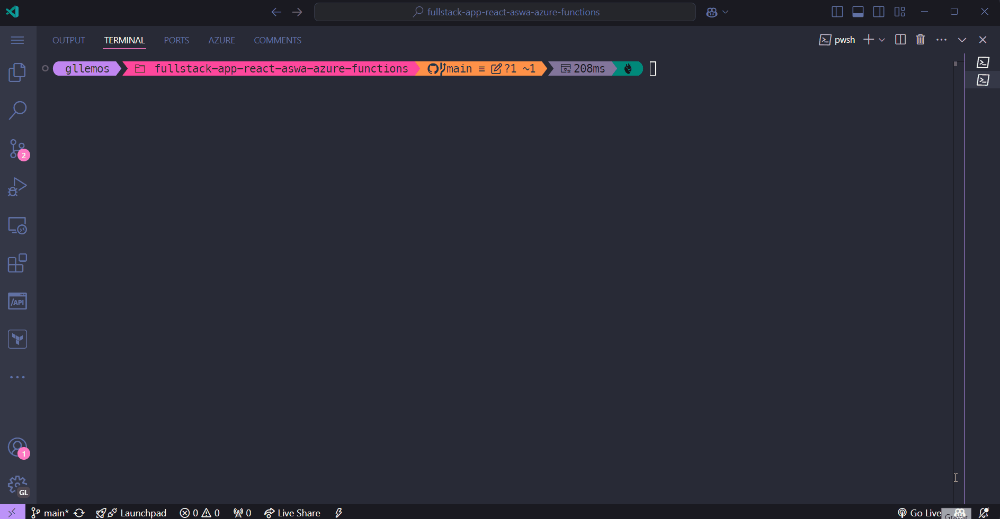

# Session 09: Running the Application (FrontEnd)

Congratulations on making it this far! 🎉🥳

Now let’s get our application running locally and see all the concepts we've learned in action!

## Setting Up the Environment

Before running the application, make sure you're in the project root folder (`client`) and that all required packages are installed. If you haven't done this yet, run the following command:

```bash
npm install
```

## Starting the Application

To run our complete application (Frontend only with the Mock API), open the terminal and execute the following command:

```bash
npm run dev-start
```

After running these commands, you should see:

- The development server running at `http://localhost:5173`
- The mock API (`json-server`) available at `http://localhost:3000`

Now, open your browser and go to `http://localhost:5173` to see the application in action.

See the gif below to understand how the application should behave:



If everything went well, you’ll see the application running, and you can interact with it as shown in the gif above. If you got the application to run, congratulations! 🎉🥳

## Conclusion and next steps

Congratulations! You’ve successfully completed the first phase of our development workshop! You developed a modern React application, using key concepts and practices from the React ecosystem. Specifically, you used:

- 🔹TypeScript for safe typing
- 🔹React with Hooks for state management
- 🔹Tailwind CSS for a modern interface
- 🔹Axios for API communication
- 🔹Json-server to simulate a BackEnd

Now, you can continue improving the application by adding new features and enhancing the interface. And, of course, you can keep learning and diving deeper into React and its technologies.

Microsoft offers a free online learning platform called [Microsoft Learn](https://learn.microsoft.com/?WT.mc_id=javascript-00000-gllemos), where you can find several courses on React, TypeScript, Tailwind CSS, and more.

Here are some suggested next steps to keep learning and sharpening your skills:

- 📌 **[Free Course - Creating your first web apps with React](https://learn.microsoft.com/training/paths/react/?WT.mc_id=javascript-00000-gllemos)**
- 📌 **[Free Course - Web Development for Beginners](https://learn.microsoft.com/training/paths/web-development-101/?WT.mc_id=javascript-00000-gllemos)**
- 📌 **[Free Course - Build JavaScript applications with Node.js](https://learn.microsoft.com/training/paths/build-javascript-applications-nodejs/?WT.mc_id=javascript-00000-gllemos)**
- 📌 **[Free Course - Build web pages with HTML and CSS for beginners](https://learn.microsoft.com/training/paths/build-web-pages-html-css-for-beginners/?WT.mc_id=javascript-00000-gllemos)**
- 📌 **[Free Course - Using GitHub Copilot with JavaScript](https://learn.microsoft.com/training/modules/introduction-copilot-javascript/?WT.mc_id=javascript-00000-gllemos)**
- 📌 **[Free Course - Get started with web development using Visual Studio Code](https://learn.microsoft.com/training/modules/get-started-with-web-development/?WT.mc_id=javascript-00000-gllemos)**

But hold on! This is just the beginning! We still need to develop the BackEnd of our application and deploy everything using best practices.

In the next phase of our workshop, we will dive into BackEnd development using Azure Functions! You will learn to:

- 🔹Develop a RESTful API using Azure Functions
- 🔹Integrate the FrontEnd with the BackEnd
- 🔹Integrate with a cloud database
- 🔹Deploy the complete application on Azure using Azure Static Web Apps, but with IaC using BicepLang
- 🔹And much more!

What you have developed so far will serve as a solid foundation for the next phase of the workshop, where we will turn our application into a complete, robust solution that will prepare you not only to create CRUDs but also to build comprehensive, scalable solutions using best industry practices with Azure.

To continue your journey:

1. Try adding new features to the current application
2. Explore more about the concepts we’ve learned
3. Get ready for the next phase of the workshop on **[Azure Functions](https://learn.microsoft.com/training/modules/explore-azure-functions/?WT.mc_id=javascript-00000-gllemos)**

Don’t forget to:

- 💡 Save your progress on GitHub
- 💡 Document any modifications you make
- 💡 Share your learning with other developers

Want to keep learning and turn this application into a full solution with a cloud backend? Join us in the next workshop phase, where we’ll explore the world of serverless development with Azure Functions!

Thank you for participating in this learning journey! See you in the next phase! 🚀🚀🚀