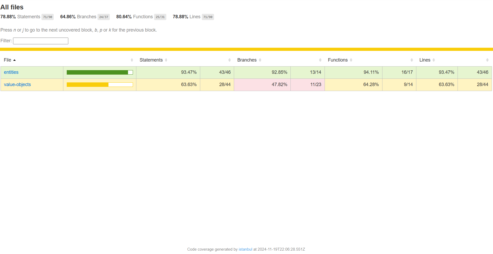

# Session 13: Testing the `Employee` Entity

In this session, we will learn how to properly test our `Employee` entity, ensuring that all business rules are working as expected.

Tests are essential not only to verify current functionality but also to facilitate future updates and prevent regressions.

> Note: The goal of this course is not to teach you how to write tests. Instead, it aims to make your application more scalable, robust, and secure by using Azure services. Exceptionally, in this session, we will explain basic test creation. Therefore, we will not be testing the entire application, only the `Employee` entity. Feel free to deepen your knowledge in testing or even implement more complex tests throughout the application.

## Introduction to Domain Testing

In the context of Domain-Driven Design (DDD), testing domain entities is essential for the following reasons:

- Ensures business rules are applied correctly.
- Acts as a living documentation of expected behavior.
- Facilitates future refactoring.
- Prevents regressions.
- Helps maintain domain integrity.

Now that we understand the basic importance of domain tests, let’s start setting up the environment to test the `Employee` entity.

## Setting Up the Test Environment

As we are using TypeScript in our application, we need to configure the test environment appropriately to ensure correct test execution. Follow the steps below:

1. Let’s install all necessary dependencies:

```bash
# Core Jest and TypeScript dependencies
npm install --save-dev jest @types/jest ts-jest ts-node

# Babel dependencies to support TypeScript
npm install --save-dev @babel/core @babel/preset-env @babel/preset-typescript
```

2. Now, let’s configure Babel, which helps us transpile TypeScript code to JavaScript. Create a file named `.babelrc` at the project root and add the following content:

```json
{
  "presets": [
    "@babel/preset-env",
    "@babel/preset-typescript"
  ]
}
```

3. Create a Jest configuration file named `jest.config.ts` at the project root with the following content:

```typescript
/** @type {import('ts-jest').JestConfigWithTsJest} */
module.exports = {
  preset: 'ts-jest',
  testEnvironment: 'node',
  roots: ['<rootDir>/src'],
  transform: {
    '^.+\\.tsx?$': 'ts-jest',
  },
  testRegex: '(/__tests__/.*|(\\.|/)(test|spec))\\.tsx?$',
  moduleFileExtensions: ['ts', 'tsx', 'js', 'jsx', 'json', 'node'],
  collectCoverage: true,
  coverageDirectory: 'coverage',
  coverageReporters: ['text', 'lcov', 'clover'],
  verbose: true
};
```

4. Now it’s time to update the `package.json` file to add the test scripts. Add the following content:

```json
  "scripts": {
    "build": "tsc",
    "watch": "tsc -w",
    "clean": "rimraf dist",
    "prestart": "npm run clean && npm run build",
    "start": "func start",
    "test": "jest --detectOpenHandles",
    "test:watch": "jest --watch",
    "test:coverage": "jest --coverage"
  }
```

5. Finally, let’s create a structured folder for our tests. Create a folder named `__tests__` within the `src` folder and add a file named `employee.test.ts` with the following content:

```bash
mkdir -p src/domain/entities/__tests__/employee.test.ts
```

Now, let’s start writing tests for the `Employee` entity.

## Implementing the Tests

We will implement tests for our `Employee` entity. Our test suite will be organized into logical groups so that if you want to add more tests, you can easily add more groups.

<details><summary><b>src/domain/entities/__tests__/employee.spec.ts</b></summary>

```typescript
import Employee from "../employee";

describe('Test Employee Entity', () => {
  beforeEach(() => {
    jest.useFakeTimers();
  });

  afterEach(() => {
    jest.useRealTimers();
  });

  // Valid data to reuse in tests
  const validEmployeeData = {
    id: 'emp-123',
    name: 'John Doe',
    jobRole: 'Software Engineer',
    salary: 5000,
    registration: 123456
  };

  describe('Employee Creation', () => {
    it('should create a valid employee', () => {
      const employee = new Employee(
        validEmployeeData.id,
        validEmployeeData.name,
        validEmployeeData.jobRole,
        validEmployeeData.salary,
        validEmployeeData.registration
      );

      expect(employee.getId()).toBe(validEmployeeData.id);
      expect(employee.getName()).toBe(validEmployeeData.name);
      expect(employee.getJobRole()).toBe(validEmployeeData.jobRole);
      expect(employee.getSalary()).toBe(validEmployeeData.salary);
      expect(employee.getEmployeeRegistration()).toBe(validEmployeeData.registration);
      expect(employee.getCreatedAt()).toBeInstanceOf(Date);
      expect(employee.getUpdatedAt()).toBeInstanceOf(Date);
    });

    describe('Name Validation', () => {
      it('should throw error when name is too short', () => {
        expect(() => {
          new Employee(
            validEmployeeData.id,
            'J',
            validEmployeeData.jobRole,
            validEmployeeData.salary,
            validEmployeeData.registration
          );
        }).toThrow('Employee name must be at least 2 characters long');
      });

      it('should throw error when name is too long', () => {
        const longName = 'a'.repeat(101);
        expect(() => {
          new Employee(
            validEmployeeData.id,
            longName,
            validEmployeeData.jobRole,
            validEmployeeData.salary,
            validEmployeeData.registration
          );
        }).toThrow('Employee name cannot exceed 100 characters');
      });

      it('should throw error when name contains invalid characters', () => {
        expect(() => {
          new Employee(
            validEmployeeData.id,
            'John@Doe123',
            validEmployeeData.jobRole,
            validEmployeeData.salary,
            validEmployeeData.registration
          );
        }).toThrow('Employee name contains invalid characters');
      });
    });

    describe('Job Role Validation', () => {
      it('should throw error when job role is invalid', () => {
        expect(() => {
          new Employee(
            validEmployeeData.id,
            validEmployeeData.name,
            '',
            validEmployeeData.salary,
            validEmployeeData.registration
          );
        }).toThrow('Job role must be at least 2 characters long');
      });

      it('should throw error when job role is too long', () => {
        const longRole = 'a'.repeat(51);
        expect(() => {
          new Employee(
            validEmployeeData.id,
            validEmployeeData.name,
            longRole,
            validEmployeeData.salary,
            validEmployeeData.registration
          );
        }).toThrow('Job role cannot exceed 50 characters');
      });
    });

    describe('Salary Validation', () => {
      it('should throw error when salary is negative', () => {
        expect(() => {
          new Employee(
            validEmployeeData.id,
            validEmployeeData.name,
            validEmployeeData.jobRole,
            -5000,
            validEmployeeData.registration
          );
        }).toThrow('Salary cannot be negative');
      });

      it('should throw error when salary is zero', () => {
        expect(() => {
          new Employee(
            validEmployeeData.id,
            validEmployeeData.name,
            validEmployeeData.jobRole,
            0,
            validEmployeeData.registration
          );
        }).toThrow('Salary cannot be zero');
      });
    });

    describe('Registration Validation', () => {
      it('should throw error when registration is invalid (less than 6 digits)', () => {
        expect(() => {
          new Employee(
            validEmployeeData.id,
            validEmployeeData.name,
            validEmployeeData.jobRole,
            validEmployeeData.salary,
            12345
          );
        }).toThrow('Employee registration must be exactly 6 digits');
      });

      it('should throw error when registration is invalid (more than 6 digits)', () => {
        expect(() => {
          new Employee(
            validEmployeeData.id,
            validEmployeeData.name,
            validEmployeeData.jobRole,
            validEmployeeData.salary,
            1234567
          );
        }).toThrow('Employee registration must be exactly 6 digits');
      });

      it('should throw error when registration is not an integer', () => {
        expect(() => {
          new Employee(
            validEmployeeData.id,
            validEmployeeData.name,
            validEmployeeData.jobRole,
            validEmployeeData.salary,
            123456.7
          );
        }).toThrow('Employee registration must be an integer number');
      });

      it('should throw error when registration is negative', () => {
        expect(() => {
          new Employee(
            validEmployeeData.id,
            validEmployeeData.name,
            validEmployeeData.jobRole,
            validEmployeeData.salary,
            -123456
          );
        }).toThrow('Employee registration must be greater than 0 and not negative');
      });
    });
  });

  describe('Employee Updates', () => {
    let employee: Employee;

    beforeEach(() => {
      employee = new Employee(
        validEmployeeData.id,
        validEmployeeData.name,
        validEmployeeData.jobRole,
        validEmployeeData.salary,
        validEmployeeData.registration
      );
    });

    it('should update employee name', () => {


      const newName = 'John Smith';
      employee.updateName(newName);
      expect(employee.getName()).toBe(newName);
    });

    it('should update job role', () => {
      const newRole = 'Senior Software Engineer';
      employee.updateJobRole(newRole);
      expect(employee.getJobRole()).toBe(newRole);
    });

    it('should give salary increase', () => {
      const increasePercentage = 10;
      const originalSalary = employee.getSalary();
      const expectedSalary = originalSalary * (1 + increasePercentage / 100);

      employee.giveSalaryIncrease(increasePercentage);

      expect(employee.getSalary()).toBe(expectedSalary);
    });

    it('should throw error when salary increase is greater than 100%', () => {
      expect(() => {
        employee.giveSalaryIncrease(101);
      }).toThrow('Percentage cannot be greater than 100');
    });

    it('should update timestamps when making changes', () => {
      const originalUpdatedAt = employee.getUpdatedAt();
      jest.advanceTimersByTime(1000);
      employee.updateName('John Smith');

      expect(employee.getUpdatedAt().getTime())
        .toBeGreaterThan(originalUpdatedAt.getTime());
    });

    it('should maintain createdAt timestamp after updates', () => {
      const originalCreatedAt = employee.getCreatedAt();
      employee.updateName('John Smith');

      expect(employee.getCreatedAt()).toEqual(originalCreatedAt);
    });
  });

  describe('Employee Serialization', () => {
    it('should correctly serialize to JSON', () => {
      const employee = new Employee(
        validEmployeeData.id,
        validEmployeeData.name,
        validEmployeeData.jobRole,
        validEmployeeData.salary,
        validEmployeeData.registration
      );

      const json = employee.toJSON();

      expect(json).toMatchObject({
        id: validEmployeeData.id,
        name: validEmployeeData.name,
        job_role: validEmployeeData.jobRole,
        salary: validEmployeeData.salary,
        employee_registration: validEmployeeData.registration
      });

      expect(json.created_at).toBeInstanceOf(Date);
      expect(json.updated_at).toBeInstanceOf(Date);
    });
  });
});
```

</details>

Phew! Quite a lot, right? But in this case, we are testing:

- **Valid Employee Creation**
   - Verifies if an employee is created correctly with valid data.

- **Name Validations**
   - Checks if the name is too short or too long or contains invalid characters.

- **Job Role Validations**
  - Checks if a given job role is too short, too long, or in an invalid format.

- **Salary Validations**
  - Checks if the salary is negative or zero.
  - Checks if the salary is correctly increased.

- **Employee Registration Validations**
  - Checks if the employee registration is a positive integer with 6 digits.
  - Also checks if the employee’s registration number is a negative number.

- **Employee Updates**
   - Checks if the employee’s name, job role, and salary are updated correctly.
   - Checks if the salary is increased correctly.
   - Checks if timestamps are updated correctly.

- **Employee Serialization**
   - Checks if the employee is correctly serialized to JSON.
   - Also verifies that all properties are correct.

## Running the Tests

Now that we have the tests implemented, let’s run them to ensure everything is working correctly. Run the following commands in different terminals, remembering that they should be executed within the `api` folder:

```bash
npm test               # Runs all tests once
npm run test:watch    # Runs in watch mode (useful during development)
npm run test:coverage # Runs and generates a coverage report
```

## Analyzing Test Coverage

Run the command `npm run test:coverage` to generate a test coverage report. The report will be generated in the `coverage` folder, and you can open it in your browser to analyze test coverage.



In the terminal, you’ll see something like this:

```bash
---------------------------|---------|----------|---------|---------|-------------------
| File        | % Stmts | % Branch | % Funcs | % Lines | Uncovered Line #s |
| ----------- | ------- | -------- | ------- | ------- | ----------------- |
| All files   | 78.16   | 63.88    | 80.64   | 78.16   |
| entities    | 93.02   | 92.3     | 94.11   | 93.02   |
| employee.ts | 93.02   | 92.3     | 94.11   | 93.02   | 61,108-109        |
```

This coverage report shows:

- Tested lines of code
- Tested branches (conditionals)
- Tested functions

Whenever you add or modify code, run the tests and check the coverage to ensure everything is working as expected. This is essential to maintain code quality and prevent regressions.

## Best Practices in Testing

**1. Arrange-Act-Assert**: Organize your tests into three parts: arrange, act, and assert. This makes the test more readable and easier to understand. Here’s an example:

```typescript
it('should update employee name', () => {
  // Arrange
  const employee = new Employee(/* ... */);
  const newName = 'John Smith';

  // Act
  employee.updateName(newName);

  // Assert
  expect(employee.getName()).toBe(newName);
});
```

**2. Descriptive Tests**: Give descriptive names to your tests so it’s easy to understand what is being tested. Avoid generic names like `test1`, `test2`, etc.

```typescript
// ❌ Bad
it('should work', () => {})

// ✅ Good
it('should throw error when name contains invalid characters', () => {})
```

**3. Consistent Test Data**: Use consistent and reusable data in your tests. This makes maintenance easier and avoids code repetition.

```typescript
const validEmployeeData = {
  id: 'emp-123',
  name: 'John Doe',
  // ...
};
```

## Conclusion

In this session, we achieved a significant milestone in our application development by establishing a robust test structure for our `Employee` entity. The careful configuration of the test environment using TypeScript provides us with a solid foundation to ensure the quality and reliability of our code.

Using TypeScript in our test environment is not only a technical choice but a strategic decision that enables us to detect errors at compile-time and provides better tooling support during development. This strong typing helps us avoid common mistakes and makes our code safer and easier to maintain.

The ability to generate detailed code coverage reports offers us clear visibility into which parts of our domain are adequately tested and which areas might need additional attention. These reports serve not only as a quality metric but also as a guide for our continuous development, helping us identify blind spots in our test suite.

The most significant aspect of this session, however, is how our tests now act as guardians of our domain’s business rules. Every test we write is not just a technical check but an explicit statement of how our `Employee` entity should behave according to business rules. This gives us confidence to evolve our application, knowing that any violation of these rules will be immediately detected by our test suite.

With this foundation established, we are well-positioned to move to the next phase of our development, where we will implement the persistence layer through repositories. The confidence provided by our test suite allows us to proceed with this implementation, knowing that the behavior of our domain will remain intact.

## Next Session: Implementing Repositories

In the next session, we'll define the repository contract and understand the importance of the Repository pattern in Domain-Driven Design. We will learn:

- The importance of the Repository pattern in Domain-Driven Design.
- How the Repository isolates the domain from persistence.
- How to define the `IEmployeeRepository` repository contract.
  
Let's continue our application development journey and explore how repositories help us maintain the integrity of our domain and separate persistence concerns from the rest of the application. And, we'll see you in the next session!

**[Previous: Session 12 ⬅️](12-session.md)** | **[Next: Session 14 ➡️](14-session.md)**