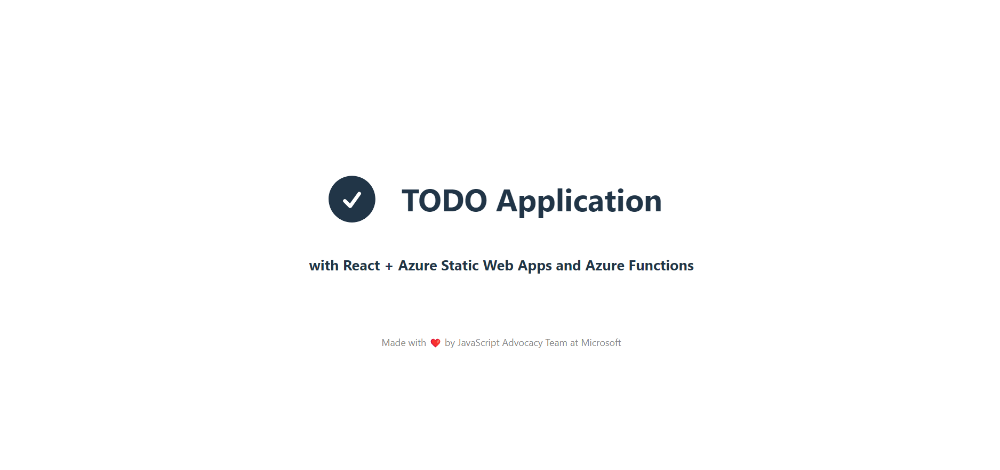

# Full Stack Todo Application com React, Azure Static Web Apps e Azure Functions - Parte 01

Link repositório: **[https://github.com/glaucia86/todo-react-aswa-azure-functions](https://github.com/glaucia86/todo-react-aswa-azure-functions)**

## Link para o vídeo (Live Coding) da Parte 01:

Vídeo: [Full Stack Todo App with React, Azure Static Web Apps and Azure Functions - Parte 01](https://www.youtube.com/live/lzCy6C_rf4c?si=3ULSG8OFS2FoKR5P)

## Introdução ao Projeto

O objetivo deste projeto é desenvolver uma aplicação Todo List utilizando React, integrando-a com serviços Azure como:

- 🔹Azure Static Web Apps
- 🔹Azure Functions
- 🔹Azure Container Apps
- 🔹Azure SQL Database

Além disso, utilizaremos o Prisma como ORM e o GitHub Actions para CI/CD. Este projeto visa demonstrar como combinar essas tecnologias para criar uma aplicação web robusta, escalável e de fácil manutenção.

## Configuração Inicial do Projeto

### Passo 1: Criação do Projeto React com Vite

Começamos criando um novo projeto React utilizando Vite, uma ferramenta de build moderna e rápida que oferece uma experiência de desenvolvimento otimizada. Para isso, executamos o seguinte comando:

```bash
npm create vite@latest todo-list -- --template react-ts
```

Este comando inicializa um novo projeto React com TypeScript, configurando um ambiente de desenvolvimento leve e eficiente.

### Passo 2: Instalação de Dependências

Após a criação do projeto, navegamos para o diretório criado e instalamos as dependências necessárias:

```bash	
cd todo-list
npm install
```

Isso garante que todas as bibliotecas e ferramentas necessárias estejam disponíveis para começar a desenvolver a aplicação.

### Integração do Tailwind CSS

### Passo 3: Instalação e Configuração do Tailwind CSS

Para adicionar o Tailwind CSS ao nosso projeto, seguimos os seguintes passos:

- 1. Instalamos o Tailwind CSS e suas dependências:

```bash
npm install -D tailwindcss postcss autoprefixer
```

- 2. Inicializamos o arquivo de configuração do Tailwind CSS:

```bash
npx tailwindcss init
```

- 3. Configuração do arquivo `tailwind.config.js`:

Atualizamos o arquivo de configuração do Tailwind para incluir os caminhos dos nossos arquivos de template:

```javascript
/** @type {import('tailwindcss').Config} */
export default {
  content: ['./index.html', './src/**/*.{js,jsx,ts,tsx}'],
  theme: {
    extend: {},
  },
  plugins: [],
};
```

Isso garante que o Tailwind CSS seja aplicado a todos os componentes e páginas da aplicação.

- 4. Adição das diretivas do Tailwind ao arquivo CSS principal:

No arquivo `index.css`, importamos as diretivas do Tailwind CSS:

* `src/index.css`

```css
@import 'tailwindcss/base';
@import 'tailwindcss/components';
@import 'tailwindcss/utilities';
```

Essas diretivas carregam os estilos básicos, os componentes e as utilidades do Tailwind, preparando o ambiente para a estilização customizada da aplicação.

## Limpeza e Customização do Projeto

### Passo 4: Remoção de Componentes Desnecessários

Para começar com uma base limpa, removemos os componentes e estilos padrão gerados pelo Vite. Isso inclui a remoção de logos, estilos iniciais e conteúdo de exemplo no componente principal. Essa limpeza é essencial para evitar código não utilizado e focar apenas no que é relevante para o projeto.

### Passo 5: Customização Inicial

Com a base limpa, começamos a customizar nossa aplicação, adicionando um título e aplicando classes do Tailwind CSS para estilização:

* `src/App.tsx`

```jsx
function App() {
  return (
    <div className="App">
      <h1 className="text-3xl font-bold">Todo List Application</h1>
    </div>
  )
}
```

Essa customização inicial estabelece a estrutura básica da aplicação e prepara o terreno para a adição de funcionalidades.

## Adição de Ícones com Hero Icons

### Passo 6: Instalação do Hero Icons

Para melhorar a interface do usuário, decidimos utilizar o pacote Hero Icons, que oferece uma variedade de ícones SVG otimizados para uso com React e Tailwind CSS.

- 1. Instalação do Hero Icons:

```bash
npm install @heroicons/react
```

- 2. Importação e uso de um ícone:

No componente principal, importamos e utilizamos um ícone para adicionar um elemento visual à aplicação:

* `src/App.tsx`

```jsx
import { CheckCircleIcon } from '@heroicons/react/24/solid';
import './App.css';

function App() {
  return (
    <>
      <div>
        <div className='header-container'>
          <CheckCircleIcon className='logo' />
          <h1>TODO Application</h1>
        </div>

        <h2>with React + Azure Static Web Apps and Azure Functions</h2>
      </div>
      <div className='card'></div>
      <p className='read-the-docs'>
        Made with ❤️ by JavaScript Advocacy Team at Microsoft
      </p>
    </>
  );
}

export default App;
```

Essa integração adiciona um toque visual ao título da aplicação, tornando a interface mais amigável e intuitiva.

E, o resultado final é o seguinte:



## Desafios e Soluções

Durante o desenvolvimento, enfrentamos alguns desafios, principalmente relacionados à estilização e posicionamento de elementos. Utilizamos o ChatGPT como ferramenta de suporte para resolver questões específicas de CSS e Tailwind, demonstrando como a IA pode ser uma aliada no processo de desenvolvimento. Além disso, a integração com o Hero Icons exigiu ajustes finos para garantir que os ícones fossem corretamente alinhados e estilizados.

## Conclusão e Próximos Passos

Nesta primeira parte do desenvolvimento, conseguimos configurar o ambiente básico da nossa aplicação Todo List, integrando React com Vite e Tailwind CSS. Também adicionamos ícones para melhorar a interface do usuário. Este é apenas o começo de um projeto mais amplo que incluirá:

🔹Desenvolvimento da funcionalidade CRUD para as tarefas.
🔹Integração com o backend utilizando Azure Functions.
🔹Configuração do deployment com Azure Static Web Apps.
🔹Implementação de testes automatizados com Playwright e GitHub Actions.

Este projeto serve como um excelente exemplo de como tecnologias modernas podem ser combinadas para criar aplicações web eficientes e escaláveis. Continuaremos a explorar e adicionar funcionalidades em futuras sessões de desenvolvimento, onde abordaremos a integração com serviços da Azure e a implementação de práticas de CI/CD.

**[Próximo: Sessão 02 ➡️](02-session.md)**