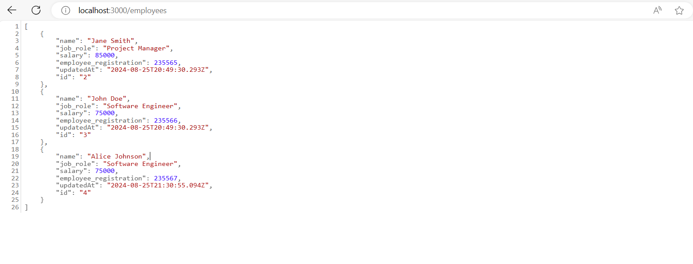

# Session 02: Configuração do Projeto - FrontEnd

Nessa sessão, vamos aprender a como configurar o ambiente de desenvolvimento para a nossa aplicação de gerenciamento de funcionários. Seguiremos um processo passo a passo para garantir que tudo esteja corretamente configurado.

Aqui vamos!

## Inicialização do projeto

Primeiro, vamos criar um novo projeto **[React](https://react.dev/)** com **[TypeScript](https://www.typescriptlang.org/)**, porém usando o **[Vite](https://vitejs.dev/)**. Vite é uma ferramenta de build rápida e moderna que funciona com React, Vue, e Vanilla JavaScript.

Para criar um novo projeto, abra o terminal e navegue até o diretório onde deseja criar o projeto. Em seguida, execute o seguinte comando:

```bash
npm create vite@latest client -- --template react-ts
```

Este comando criará um novo projeto React com TypeScript com uma estrutura básica de projeto React + TypeScript.

Agora, navegue até o diretório do projeto `client` e instale as dependências do projeto:

```bash
cd client
npm install
```

Execute o comando para ver se o projeto foi criado corretamente:

```bash
npm run dev
```

Abre o browser de sua preferência e acesse o endereço: `http://localhost:5173/`. Você verá a página inicial do projeto React com Vite.

## Instalação das dependências do projeto

No decorrer do desenvolvimento do projeto precisaremos de algumas dependências que serão necessárias para o desenvolvimento da aplicação no lado do FrontEnd. Vamos instalar essas dependências agora.

Execute o seguinte comando para instalar as dependências necessárias:

```bash
npm install react-router-dom axios sweetalert2 react-icons react-number-format
```

Vamos explicar o que cada uma dessas dependências fará no projeto:

- **[react-router-dom](https://www.npmjs.com/package/react-router-dom)**: é uma biblioteca de roteamento para React que nos permite navegar entre diferentes componentes React. Como criaremos algumas páginas para a aplicação, precisaremos dessa biblioteca para navegar entre elas.
  
- **[axios](https://www.npmjs.com/package/axios)**: é uma biblioteca que nos permite fazer requisições HTTP para o servidor. Usaremos o Axios para fazer requisições HTTP para o servidor da API. Através dele também faremos a comunicação com o servidor (BackEnd).
  
- **[sweetalert2](https://www.npmjs.com/package/sweetalert2)**: é uma biblioteca que nos permite exebir alerts de mensagens personalizadas. Assim sendo, usaremos o SweetAlert2 para exibir mensagens de sucesso, erro, e alerta para o usuário.
  
- **[react-icons](https://www.npmjs.com/package/react-icons)**: é uma biblioteca que nos permite usar ícones em nossos componentes React. Usaremos o React Icons para adicionar ícones aos botões da aplicação.
  
- **[react-number-format](https://www.npmjs.com/package/react-number-format)**: é uma biblioteca que nos permite formatar números em nossos componentes React. Usaremos o React Number Format para formatar o campo `salary` do funcionário.
  
Agora vamos instalar as dependências de desenvolvimento:

```bash
npm install -D @types/react-router-dom tailwindcss postcss autoprefixer
```

Vamos explicar o que cada uma dessas dependências fará no projeto:

- **[@types/react-router-dom](https://www.npmjs.com/package/@types/react-router-dom)**: é um pacote de tipos de TypeScript para a biblioteca `react-router-dom`. Usaremos esse pacote para adicionar tipos ao `react-router-dom`.
- **[tailwindcss, postcss, autoprefixer](https://www.npmjs.com/package/tailwindcss)**: é uma biblioteca de utilitários CSS que nos permite criar estilos rapidamente. Usaremos o Tailwind CSS para estilizar a aplicação.

> **Nota**: O Tailwind CSS é uma biblioteca de utilitários CSS que nos permite criar estilos rapidamente. Usaremos o Tailwind CSS para estilizar a aplicação. Se você não está familiarizado com o Tailwind CSS, recomendamos que você leia a [documentação oficial](https://tailwindcss.com/docs/installation).

## Configuração do Tailwind CSS

Como estaremos o usando o Tailwind CSS para estilizar a aplicação, precisamos antes configurá-lo para ser usado no projeto. Para isso, abre o terminal dentro da pasta `client` e execute o seguinte comando:

```bash
npx tailwindcss init -p
```

Ao executar o comando acima, será criado dois arquivos na raiz do projeto:

- `tailwind.config.js`: é o arquivo de configuração do Tailwind CSS. Neste arquivo, você pode personalizar as configurações do Tailwind CSS.
- `postcss.config.js`: é o arquivo de configuração do PostCSS. Neste arquivo, você pode adicionar plugins do PostCSS.

Precisaremos fazer uma pequena alteração no arquivo `tailwind.config.js`. Abra o arquivo `tailwind.config.js` e adicione o seguinte código:

- **file**: `tailwind.config.js`:

```javascript
/** @type {import('tailwindcss').Config} */
export default {
  content: ['./index.html', './src/**/*.{js,ts,jsx,tsx}'],
  theme: {
    extend: {},
  },
  plugins: [],
};
```

Esse arquivo configurará o Tailwind para processar arquivos HTML e JavaScript/TypeScript dentro do diretório `src`.

Ainda precisamos fazer outras configurações para que o Tailwind CSS funcione corretamente. Abra o arquivo `src/index.css` e adicione o seguinte código:

- **file**: `src/index.css`:

```css
@tailwind base;
@tailwind components;
@tailwind utilities;
```

Esse arqivo permitirá que você use as classes do Tailwind CSS em toda a sua aplicação.

## Configuração do ESLint

O ESLint é uma ferramenta de análise de código estática para identificar e corrigir problemas no código JavaScript/TypeScript. Como criamos o projeto usando o Vite, o ESLint já está configurado para funcionar com o TypeScript. Porém, verifique se o arquivo `eslint.config.js` está configurado corretamente.

<details><summary><b>eslint.config.js</b></summary>
<br/>

```javascript
import js from '@eslint/js'
import globals from 'globals'
import reactHooks from 'eslint-plugin-react-hooks'
import reactRefresh from 'eslint-plugin-react-refresh'
import tseslint from 'typescript-eslint'

export default tseslint.config(
  { ignores: ['dist'] },
  {
    extends: [js.configs.recommended, ...tseslint.configs.recommended],
    files: ['**/*.{ts,tsx}'],
    languageOptions: {
      ecmaVersion: 2020,
      globals: globals.browser,
    },
    plugins: {
      'react-hooks': reactHooks,
      'react-refresh': reactRefresh,
    },
    rules: {
      ...reactHooks.configs.recommended.rules,
      'react-refresh/only-export-components': [
        'warn',
        { allowConstantExport: true },
      ],
    },
  },
)
```

</details>
<br/>

Essa é a configuração básica do ESLint para o projeto gerado automaticamente pelo Vite. Sem contar que essa configuração inclui regras recomendadas para JavaScript e TypeScript, bem como regras específicas para React Hooks. 

Porém, você pode adicionar outras regras personalizadas no que for melhor para o seu projeto.

## Configuração do script de API Mock usando o `json-server`

Como o nosso BackEnd ainda não está pronto, utilizaremos um pacote chamado `json-server` para simular uma API REST. Vamos instalar o `json-server` como uma dependência de desenvolvimento.

Execute o seguinte comando para instalar o `json-server`:

```bash
npm install json-server
```

Em seguida, precisaremos criar um arquivo na raiz do projeto chamado `db.json`. Por que? Pois esse arquivo será usado para armazenar os dados da nossa aplicação enquanto ainda não temos o BackEnd pronto.

<details><summary><b>db.json</b></summary>
<br/>

```json
{
  "employees": [
    {
      "name": "Jane Smith",
      "job_role": "Project Manager",
      "salary": 85000,
      "employee_registration": 235565,
      "updatedAt": "2024-08-25T20:49:30.293Z",
      "id": "2"
    },
    {
      "name": "John Doe",
      "job_role": "Software Engineer",
      "salary": 75000,
      "employee_registration": 235566,
      "updatedAt": "2024-08-25T20:49:30.293Z",
      "id": "3"
    },
    {
      "name": "Alice Johnson",
      "job_role": "Software Engineer",
      "salary": 75000,
      "employee_registration": 235567,
      "updatedAt": "2024-08-25T21:30:55.094Z",
      "id": "4"
    }
  ]
}
```

</details>
<br/>

Agora que temos o arquivo `db.json` criado, vamos adicionar um script no arquivo `package.json` para iniciar o `json-server`. Abra o arquivo `package.json` e adicione o seguinte script:

<details><summary><b>package.json</b></summary>
<br/>

```json
  "scripts": {
    "dev": "vite",
    "build": "tsc -b && vite build",
    "lint": "eslint .",
    "preview": "vite preview",
    "mock-api": "json-server db.json --port 3000"
  },
```

</details>
<br/>

## Verificação da configuração

Agora que configuramos o ambiente de desenvolvimento para o projeto é hora de verificar se tudo está funcionando corretamente. Execute o seguinte comando no terminal do Visual Studio Code:

```bash
npm run mock-api
```

Este comando iniciará o `json-server` e criará uma API REST com os dados do arquivo `db.json`. Abra o browser de sua preferência e acesse o endereço: `http://localhost:3000/employees`. Você verá os dados dos funcionários que estão no arquivo `db.json`.



Em seguida, abra outro terminal no Visual Studio Code e execute o seguinte comando:

```bash
npm run dev
```

Este comando iniciará o servidor de desenvolvimento do Vite. Abra o browser de sua preferência e acesse o endereço: `http://localhost:5173/`. Você verá a página inicial do projeto React com Vite.

> **Nota**: se você preferir, pode executar o comando: `npm run dev-start`. Esse comando iniciará a aplicação e o `json-server` ao mesmo tempo.

## Estrutura do projeto

Agora que configuramos o ambiente de desenvolvimento para o projeto, a estrutura do projeto deve ser semelhante a esta:

```text
client/
  ├── node_modules/
  ├── public/
  ├── src/
  │   ├── components/
  │   ├── pages/
  │   ├── services/
  │   ├── types/
  │   ├── App.css
  │   ├── App.tsx
  │   ├── index.css
  │   ├── main.tsx
  │   ├── vite-env.d.ts
  ├── .gitignore
  ├── db.json
  ├── eslint.config.js
  ├── index.html
  ├── package-lock.json
  ├── package.json
  ├── postcss.config.js
  ├── README.md
  ├── tailwind.app.json
  ├── tsconfig.json
  ├── tsconfig.node.json
  ├── vite.config.ts
```

Boa parte dessa estrutura foi criada automaticamente pelo Vite quando criamos o projeto. Porém, ao decorrer do desenvolvimento, criaremos novas pastas e arquivos para organizar o projeto.

## Conclusão

E é isso! Nessa sessão, aprendemos a configurar o ambiente de desenvolvimento para o projeto de gerenciamento de funcionários.
Também configuramos o Tailwind CSS, ESLint, e o `json-server` para simular uma API REST.

Na próxima sessão, vamos criar a estrutura de pastas e arquivos que serão necessários para o desenvolvimento da aplicação.

Até a próxima sessão!

**[Anterior: Sessão 01 ➡️](01-session.md)** | **[Próximo: Sessão 03 ➡️](03-session.md)**


