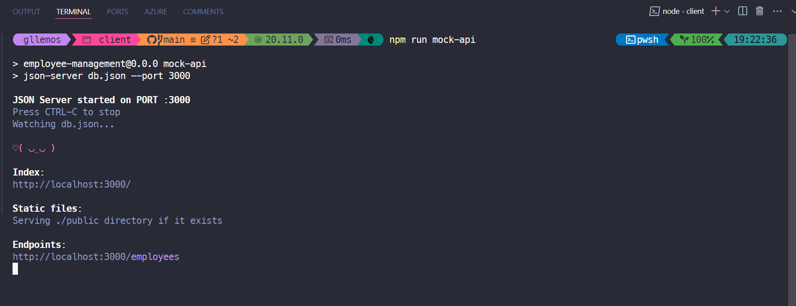
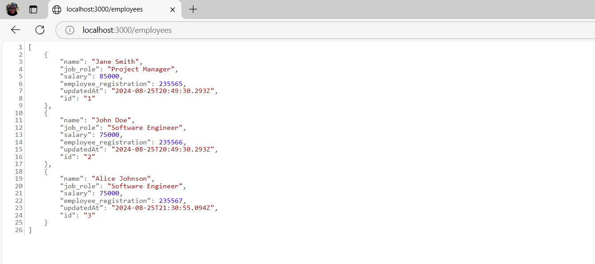

# Session 08: Configuração do Mock API

Nesta sessão, vamos configurar um servidor mock para simular uma API REST, permitindo que nossa aplicação realize operações CRUD reais durante o desenvolvimento do lado do cliente.

Utilizaremos o pacote chamado `json-server`, uma ferramenta poderosa que transforma um arquivo JSON em uma API REST completa.

Vamos começar?!

## Criando o Arquivo de Dados Mock

Primeiramente, vamos criar nosso arquivo de dados que servirá como a nossa "base de dados" mock.

Crie um arquivo chamado `db.json` na raiz do projeto:

```bash
touch db.json
```

Agora, adicione o seguinte conteúdo ao arquivo `db.json`:

```json
{
  "employees": [
    {
      "name": "Jane Smith",
      "job_role": "Project Manager",
      "salary": 85000,
      "employee_registration": 235565,
      "updatedAt": "2024-08-25T20:49:30.293Z",
      "id": "1"
    },
    {
      "name": "John Doe",
      "job_role": "Software Engineer",
      "salary": 75000,
      "employee_registration": 235566,
      "updatedAt": "2024-08-25T20:49:30.293Z",
      "id": "2"
    },
    {
      "name": "Alice Johnson",
      "job_role": "Software Engineer",
      "salary": 75000,
      "employee_registration": 235567,
      "updatedAt": "2024-08-25T21:30:55.094Z",
      "id": "3"
    }
  ]
}
```

Perfeito! Agora temos um arquivo JSON com alguns dados de exemplo. Lembrando que você pode adicionar mais dados conforme necessário.

Vamos continuar a configuração do nosso servidor mock.

## Instalando e Configurando o `json-server`

Vamos instalar o `json-server` como uma dependência de desenvolvimento. Para isso, execute o seguinte comando:

```bash
npm install json-server --save-dev
```

Agora, adicione o seguinte script ao arquivo `package.json`:

```json
// ... demais scripts
"scripts": {
  "mock-api": "json-server db.json --port 3000"
}
```

Vamos testar o servidor mock. Execute o seguinte comando:

```bash
npm run mock-api
```

Se tudo ocorrer bem, você verá uma mensagem semelhante à imagem abaixo:



## Verificando a Configuração

Agora que o servidor mock está rodando, abra seu navegador e acesse a URL `http://localhost:3000/employees`. Você verá os dados que adicionamos ao arquivo `db.json`.



Se desejar, podemos testar de uma forma diferente. Mantenha o servidor mock rodando, abra um novo terminal e execute o seguinte comando:

```bash
curl http://localhost:3000/employees
```

Você verá a saída dos dados, agora no terminal. Podemos testar outras operações, como `POST`, `PUT` e `DELETE`. Vamos testar?

- Obter um funcionário específico:

```bash
curl http://localhost:3000/employees/2
```

- Adicionar um novo funcionário:

```bash
curl -X POST -H "Content-Type: application/json" -d '{
  "name": "Glaucia Lemos",
  "job_role": "Developer Advocate",
  "salary": 6500,
  "employee_registration": 889944,
  "updatedAt": "2024-10-25T20:49:30.293Z",
  "id": "4"
}' http://localhost:3000/employees
```

- Atualizar um funcionário:

```bash
curl -X PUT -H "Content-Type: application/json" -d '{
  "name": "Glaucia Lemos",
  "job_role": "Senior Developer Advocate",
  "salary": 6500,
  "employee_registration": 889944,
  "updatedAt": "2024-10-25T20:49:30.293Z",
  "id": "4"
}' http://localhost:3000/employees/4
```

- Remover um funcionário:

```bash
curl -X DELETE http://localhost:3000/employees/4
```

Após testar as operações CRUD, você pode parar o servidor mock pressionando `Ctrl + C` no terminal.

Bom trabalho! Agora temos um servidor mock configurado e pronto para ser utilizado no lado do cliente. Para isso, precisaremos ajustar nossa aplicação para consumir esses dados.

## Ajustando o Arquivo `employee.services.ts` para Consumir o Mock API

Vamos ajustar o arquivo `employee.services.ts` para consumir o servidor mock que acabamos de configurar.

Abra o arquivo `employee.services.ts` e verifique se está utilizando a URL correta para consumir a API REST.

<details><summary><b>src/services/employee.services.ts</b></summary>
<br/>

```typescript
const API_BASE_URL = 'http://localhost:3000/employees';

const employeeApi = axios.create({
  baseURL: API_BASE_URL,
  headers: {
    'Content-Type': 'application/json'
  }
});
```

</details>
<br/>

Lembre-se de que estaremos usando temporariamente o servidor mock para simular a API REST. No entanto, quando a aplicação estiver pronta para ser implantada, você precisará ajustar a URL para apontar para o servidor real, que neste caso será o Azure Functions.

## Boas Práticas e Dicas

1. **Persistência de Dados:** 
   - 👉 O `json-server` salva automaticamente as alterações no arquivo `db.json`.
   - 👉 Você pode criar um backup do arquivo para restaurar os dados quando necessário.

2. **Filtros e Ordenação:**
   - 👉 O `json-server` suporta filtros e ordenação de dados. Por exemplo:

```bash
// Filtrar por cargo
GET /employees?job_role=Software Engineer

// Ordenar por salário
GET /employees?_sort=salary&_order=desc

// Limitar resultados
GET /employees?_limit=2
```

3. **Simulando Latência:**
   - 👉 Você pode simular latência na resposta do servidor adicionando a flag `--delay` ao comando `json-server`. Por exemplo:

```bash
npm run mock-api -- --delay 1000
```

4. **Backup dos Dados:**
   - 👉 Faça backup regularmente do arquivo `db.json` para evitar a perda de dados. Por exemplo:

```bash
# Criar uma cópia do db.json
cp db.json db.backup.json

# Restaurar o backup
cp db.backup.json db.json
```

## Conclusão

Nesta sessão, configuramos um servidor mock usando o `json-server` para simular uma API REST. Isso nos permitirá desenvolver o lado do cliente sem depender de um servidor real.

Com o nosso Mock API configurado, agora temos um ambiente de desenvolvimento completo que simula perfeitamente um backend real. Isso nos permite:

- 🔹 Testar todas as operações CRUD da aplicação.
- 🔹 Trabalhar com dados persistentes durante o desenvolvimento.
- 🔹 Simular cenários reais de API.
- 🔹 Desenvolver o FrontEnd independentemente do BackEnd.

Na última parte desse tutorial (do lado do cliente), vamos testar nossa aplicação com o servidor mock e verificar se tudo está funcionando corretamente.

**[Anterior: Sessão 07 ⬅️](07-session.md)** | **[Próximo: Sessão 09 ➡️](09-session.md)**
