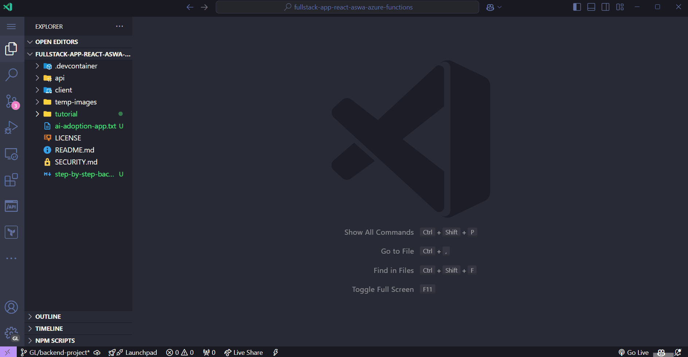
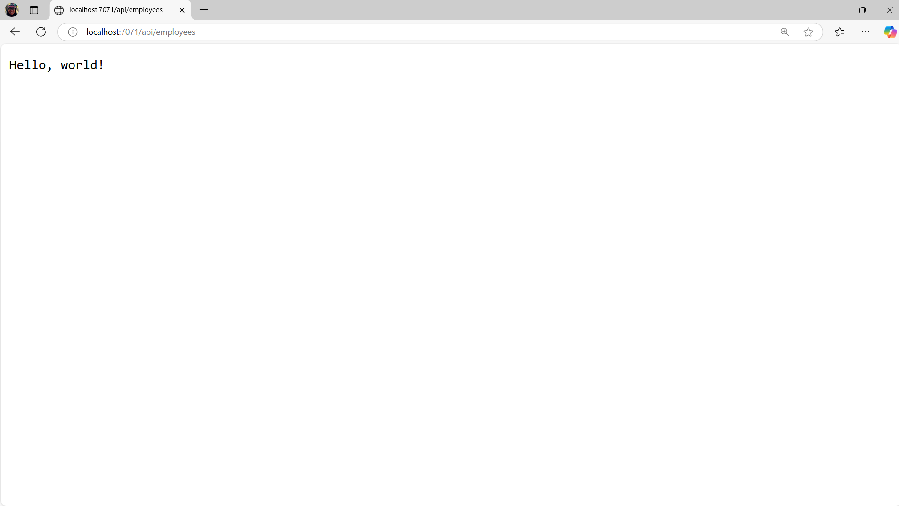

# Session 10: Configuração do Projeto BackEnd com Azure Functions

Olá, desenvolvedor(a)! 👋

Estamos agora na segunda fase do nosso workshop! Nessa sessão, vamos começar a configuração do nosso BackEnd usando o Azure Functions com TypeScript (modelo de programação v4). Este será o primeiro passo para criar uma API robusta e escalável que substituirá o nosso mock atual.

No BackEnd, utilizaremos as seguintes tecnologias:

- 🔹 **[Azure Functions (TypeScript programming model v4)](https://learn.microsoft.com/en-us/azure/azure-functions/)**
- 🔹 **[Azure Cosmos DB for MongoDB](https://learn.microsoft.com/en-us/azure/cosmos-db/mongodb/introduction)**
- 🔹 **[Prisma](https://www.prisma.io/)**
- 🔹E, muito mais...

Vamos começar? 🚀

## Pré-requisitos

Antes de começar, você precisará ter instalado em sua máquina:

- [Node.js](https://nodejs.org/en/download/) (se possível versão acima de 18)
- [TypeScript](https://www.typescriptlang.org/)
- [Visual Studio Code](https://code.visualstudio.com/download)
- [Azure Functions Core Tools](https://learn.microsoft.com/pt-br/azure/azure-functions/functions-run-local?tabs=windows%2Cisolated-process%2Cnode-v4%2Cpython-v2%2Chttp-trigger%2Ccontainer-apps&pivots=programming-language-csharp#install-the-azure-functions-core-tools)
- **[Extensão do Azure Functions a partir da versão v1.10.4 ou superior](https://marketplace.visualstudio.com/items?itemName=ms-azuretools.vscode-azurefunctions)**
- Uma conta no [Azure](https://azure.microsoft.com/pt-br/free/)

> 👉 **Nota:** Se você ainda não tem uma conta no Azure, você pode criar uma gratuitamente [aqui](https://azure.microsoft.com/pt-br/free/).

Após instalar as ferramentas necessárias, abre o terminal dentro do Visual Studio Code para saber se o Azure Functions Core Tools está instalado corretamente. Execute o comando abaixo:

```bash
func --version
```

Se tudo estiver correto, você verá a versão do Azure Functions Core Tools instalada.

## Entendendo o Azure Functions

Antes de começar a desenvolver, é importante entender o que é o Azure Functions e como ele funciona.

O Azure Functions é uma solução de computação sem servidor que permite executar pequenos trechos de código (chamados de "funções") sem precisar se preocupar com a infraestrutura. Com o Azure Functions, as funções são acionadas por uma variedade de eventos, como alterações de dados, acionadores de mensagens e temporizadores.

Resumindo:

- 🔹É um serviço de computação serverless que permite executar código sob demanda.
- 🔹Você paga apenas pelo tempo de execução do código. Pay-as-you-go.
- 🔹Escala automaticamente com base na demanda.
- 🔹Suporta várias linguagens de programação, incluindo JavaScript, TypeScript, Python, C#, Java, entre outras.
- 🔹Suporta diversos tipos de triggers, como HTTP, Blob Storage, Cosmos DB, Event Grid, entre outros. 
- 🔹Ideal para criar APIs, processamento de eventos, automações, integrações, microservices, entre outros.

O modelo de programação v4 que usaremos traz várias melhorias em relação ao modelo anterior, como:

- 🔹Sintaxe mais moderna e intuitiva.
- 🔹Melhor suporte a TypeScript
- 🔹Melhor performance
- 🔹Estrutura de projeto mais organizada

Se você quiser saber mais sobre o Azure Functions e o novo modelo de programação v4, acesse:

- 📚 **[Quickstart: Create a JavaScript function in Azure using Visual Studio Code](https://learn.microsoft.com/en-us/azure/azure-functions/create-first-function-vs-code-node?pivots=nodejs-model-v4)**
- 📚 **[Azure Functions: Node.js v4 programming model is Generally Available](https://techcommunity.microsoft.com/t5/apps-on-azure-blog/azure-functions-node-js-v4-programming-model-is-generally/ba-p/3929217)**

Agora que você já sabe o que é o Azure Functions e como ele funciona, vamos começar a configurar o nosso projeto.

## Criando o Projeto Azure Functions

Vamos criar nosso projeto Azure Functions seguindo estas etapas:

1. Crie uma nova pasta para o projeto no lado do BackEnd. Você pode chamar essa pasta de `api`.

```bash
mkdir api
cd api
```

2. No Visual Studio Code, use o comando para criar um novo projeto:

- Pressione `F1` e digite `Azure Functions: Create New Project`
- Selecione a pasta `api`
- Escolha `TypeScript` como linguagem
- Selecione o `Model V4` como modelo de programação
- Escolha o template `Http trigger`
- Digite o nome da função: `employees`
- O Visual Studio Code irá criar a estrutura do projeto do Azure Functions

Veja todo o processo de criação no gif abaixo:



## Estrutura do Projeto

Após a criação do projeto, você verá a seguinte estrutura de pastas e arquivos:

```bash
api/
 ├── src/
 │   ├── functions/
 │   │   └── employees/
 │   │       └── index.ts
 │   └── index.ts
 ├── .funcignore
 ├── .gitignore
 ├── host.json
 ├── local.settings.json
 ├── package.json
 └── tsconfig.json
```

Vamos entender o que cada arquivo e pasta faz:

- `src/`: Pasta onde ficam as funções do Azure Functions.
- `src/functions/employees.ts`: Pasta da função `employees`.
- `src/index.ts`: Arquivo principal que exporta todas as funções.
- `host.json`: Configurações globais do host do Functions
- `local.settings.json`: Configurações locais e variáveis de ambiente
- `package.json`: Arquivo de dependências do projeto
- `tsconfig.json`: Configurações do TypeScript

## Analisando o código gerado

Vamos analisar o código gerado pelo Visual Studio Code para a função `employees`:

<details><summary><b>src/functions/employees.ts</b></summary>
<br/>

```typescript
import { app, HttpRequest, HttpResponseInit, InvocationContext } from "@azure/functions";

export async function employees(request: HttpRequest, context: InvocationContext): Promise<HttpResponseInit> {
    context.log(`Http function processed request for url "${request.url}"`);

    const name = request.query.get('name') || await request.text() || 'world';

    return { body: `Hello, ${name}!` };
};

app.http('employees', {
    methods: ['GET', 'POST'],
    authLevel: 'anonymous',
    handler: employees
});
```

</details>
<br/>

### Importações

```typescript
import { app, HttpRequest, HttpResponseInit, InvocationContext } from "@azure/functions";
```

- `app`: Objeto principal para configuração das funções
- `HttpRequest`: Interface TypeScript para requisições HTTP
- `HttpResponseInit`: Interface para respostas HTTP
- `InvocationContext`: Contexto de execução da função

### Definição da Função

```typescript
export async function employees(
    request: HttpRequest, 
    context: InvocationContext
): Promise<HttpResponseInit>
```

- Função assíncrona que recebe dois parâmetros:

  - `request`: Contém dados da requisição HTTP (query params, body, headers, etc.)
  - `context`: Fornece acesso ao contexto de execução (logging, bindings, etc.)

- Retorna uma Promise de `HttpResponseInit` (resposta HTTP)

### Logging

```typescript
context.log(`Http function processed request for url "${request.url}"`);
```

- Demonstra o uso do sistema de logging integrado
- Útil para debug e monitoramento
- Logs são automaticamente integrados com Azure Application Insights

### Processamento de Requisição

```typescript
const name = request.query.get('name') || await request.text() || 'world';
```

Demonstra diferentes formas de obter dados da requisição:

- `request.query.get()`: Acessa query parameters (?name=value)
- `request.text()`: Acessa o body da requisição.
- Usa fallback para 'world' se nenhum valor for fornecido.

### Configuração da Rota

```typescript
app.http('employees', {
    methods: ['GET', 'POST'],
    authLevel: 'anonymous',
    handler: employees
});
```

- `'employees'`: Nome único da função.
- `methods`: Array de métodos HTTP permitidos.
- `authLevel`: Nível de autorização necessário.

  - `'anonymous'`: Permite acesso sem autenticação.
  - Outros níveis: `'function'`, `'admin'`.
- `handler`: Função que será executada.


## Testando a Função Localmente

Para testar a função localmente, abre o terminal no Visual Studio Code e execute o comando:

```bash
cd api
npm start
```

O Azure Functions irá iniciar o servidor localmente e você poderá acessar a função no navegador através do link `http://localhost:7071/api/employees`

Você deverá ver a mensagem `Hello, world!` no navegador, conforme a imagem abaixo:



Agora, vamos fazer um teste com um parâmetro. Mantenha o servidor rodando e abra o navegador.

Adicione `?name=John` no final da URL e pressione `Enter`. Você deverá ver a mensagem `Hello, John!` no navegador.

```bash
# Via query parameter
curl "http://localhost:7071/api/employees?name=John"

# Via POST com body
curl -X POST -H "Content-Type: text/plain" -d "John" \
  "http://localhost:7071/api/employees"
```

## Personalizando a Resposta

Vamos fazer um pequeno exercício personalizando e customizando a resposta da função `employees`.

Abra o arquivo `src/functions/employees.ts` no Visual Studio Code e faça as seguintes alterações:

<details><summary><b>src/functions/employees.ts</b></summary>
<br/>

```typescript
import { app, HttpRequest, HttpResponseInit, InvocationContext } from "@azure/functions";
import { timeStamp } from "console";

export async function employees(request: HttpRequest, context: InvocationContext): Promise<HttpResponseInit> {
    context.log(`Http function processed request for url "${request.url}"`);

    const name = request.query.get('name') || await request.text() || 'world';

    return {
        jsonBody: {
            message: "Hello", timeStamp: new Date()
        },
        headers: {
            'Content-Type': 'application/json'
        },
        status: 200
    }
};

app.http('employees', {
    methods: ['GET', 'POST'],
    authLevel: 'anonymous',
    handler: employees
});
```

</details>
<br/>

Agora, reinicie o servidor local e acesse a função no navegador. Você deverá ver a resposta personalizada em JSON:

```json
{
  "message": "Hello",
  "timeStamp": "2021-10-01T20:00:00.000Z"
}
```

## Conclusão

Nessa sessão, você aprendeu como criar um projeto do Azure Functions com o novo modelo de programação v4. Além disso, você viu como é a estrutura de pastas e arquivos gerados pelo Visual Studio Code e como executar o projeto localmente.

Na próxima sessão, vamos começar a instalar as demais dependências que usaremos nesse projeto, como o Azure Cosmos DB, Prisma, entre outros.

**[Anterior: Sessão 09 ⬅️](09-session.md)** | **[Próximo: Sessão 11 ➡️](11-session.md)**
