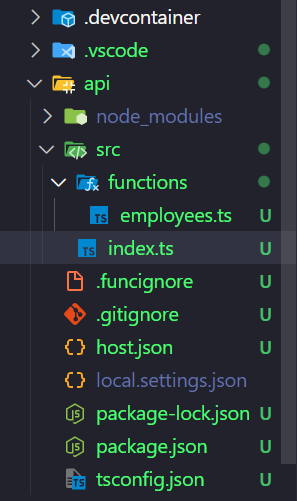
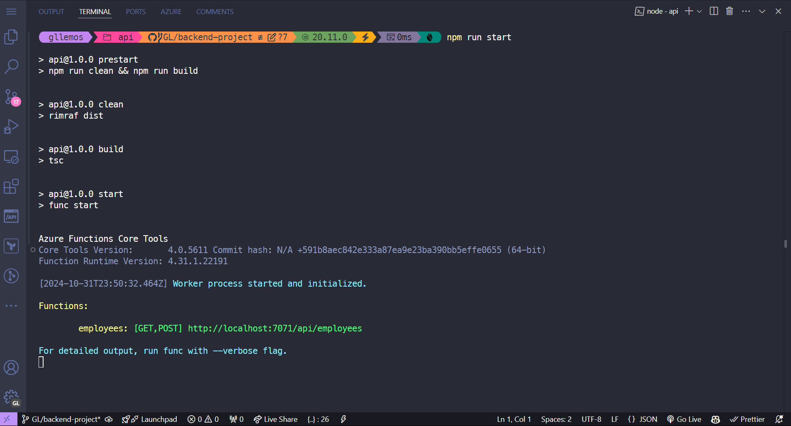
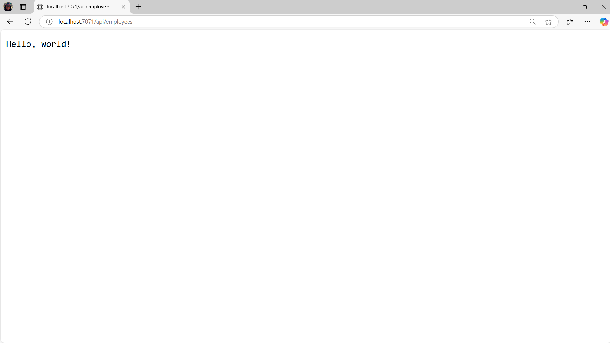

# Session 10: (Draft) Configuração do Projeto - BackEnd

Nessa sessão, vamos configurar o projeto no lado do BackEnd. Para isso, utilizaremos as seguintes tecnologias:

- 🔹Azure Functions (TypeScript programming model v4)
- 🔹Azure Cosmos DB for MongoDB
- 🔹Prisma
- 🔹E, muito mais....

## Pré-requisitos

Para prosseguir com esse tutorial, você precisa ter o seguinte:

- [Node.js](https://nodejs.org/en/download/) (se possível versão acima de 18)
- [TypeScript](https://www.typescriptlang.org/)
- [Visual Studio Code](https://code.visualstudio.com/download)
- [Azure Functions Core Tools](https://learn.microsoft.com/pt-br/azure/azure-functions/functions-run-local?tabs=windows%2Cisolated-process%2Cnode-v4%2Cpython-v2%2Chttp-trigger%2Ccontainer-apps&pivots=programming-language-csharp#install-the-azure-functions-core-tools)
- **[Extensão do Azure Functions a partir da versão v1.10.4 ou superior](https://marketplace.visualstudio.com/items?itemName=ms-azuretools.vscode-azurefunctions)**
- Uma conta no [Azure](https://azure.microsoft.com/pt-br/free/)

## O que é Azure Functions?

Azure Functions é uma solução de computação sem servidor que permite executar pequenos trechos de código (chamados de "funções") sem precisar se preocupar com a infraestrutura. Com o Azure Functions, as funções são acionadas por uma variedade de eventos, como alterações de dados, acionadores de mensagens e temporizadores.

(explicar um pouco maias sobre o Azure Functions e seus benefícios)

## Configuração Inicial do Projeto - BackEnd com Azure Functions

1. Depois de instalar as ferramentas, crie uma pasta na raiz do projeto chamada `api`
2. Abra o terminal e navegue até a pasta `api`
3. No Visual Studio Code, pressione a tecla `F1` e digite `Azure Functions: Create New Project`
4. Selecione a pasta `api` e escolha a linguagem `TypeScript`
5. Selecione o tipo do programming model `Model V4`
6. Selecione o template quie nesse caso é `Http trigger`
7. Dê um nome para a função: `employees`
8. Depois disso, o Visual Studio Code irá criar a estrutura do projeto do Azure Functions

Veja todo o processo de criação no gif abaixo:


9. Observe que com o novo modelo de programação do Azure Functions v4, o projeto é criado com a seguinte estrutura:

```bash
api
│   node_modules
└───src
│   └───functions
│     └───employees
│   │   index.ts
│   .funcignore
│   .gitignore
│   host.json
│   local.settings.json
│   package.json
│   tsconfig.json
```



10. Abre o arquivo `src/functions/employees.ts` e veja o código gerado pelo Visual Studio Code:

```typescript
import { app, HttpRequest, HttpResponseInit, InvocationContext } from "@azure/functions";

export async function employees(request: HttpRequest, context: InvocationContext): Promise<HttpResponseInit> {
    context.log(`Http function processed request for url "${request.url}"`);

    const name = request.query.get('name') || await request.text() || 'world';

    return { body: `Hello, ${name}!` };
};

app.http('employees', {
    methods: ['GET', 'POST'],
    authLevel: 'anonymous',
    handler: employees
});
```

(explicar o que o código faz com detalhes e a importância dele)

11. Além disso, ele gera um outro arquivo chamado `index.ts` que é responsável por exportar todas as funções criadas no projeto:

```typescript
import { app } from '@azure/functions';

app.setup({
    enableHttpStream: true,
});
```

(explicar o que o código faz com detalhes e a importância dele)

12. Agora para saber se o projeto está funcionando, execute o comando `npm start` no terminal. O Azure Functions irá iniciar o servidor localmente e você poderá acessar a função no navegador através do link `http://localhost:7071/api/employees`



Se você visualizar a mensagem `Hello, world!` no navegador, significa que o projeto está funcionando corretamente.



Aperte `Ctrl + C` para parar o servidor.

## Conclusão

Nessa sessão, você aprendeu como criar um projeto do Azure Functions com o novo modelo de programação v4. Além disso, você viu como é a estrutura de pastas e arquivos gerados pelo Visual Studio Code e como executar o projeto localmente.

Na próxima sessão começaremos a instalar as demais dependências que usaremos nesse projeto (explicar outras coisas....)


**[Anterior: Sessão 09 ⬅️](09-session.md)** | **[Próximo: Sessão 11 ➡️](11-session.md)**


