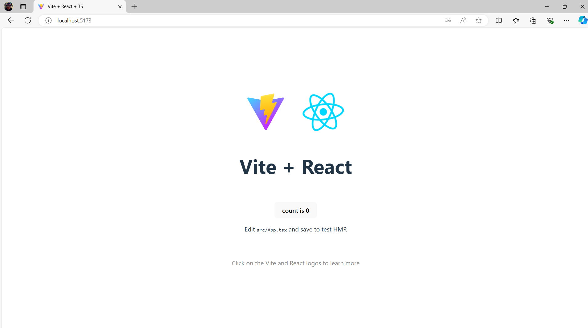

# frontend step-by-step tutorial

1. Install Vite template:

```bash
npm create vite@latest todo-list -- --template react-ts

cd todo-list
npm install
```

2. Run the app:

```bash
npm run dev
```

3. Open the app in your browser: [http://localhost:5173](http://localhost:5173)


